# 🚀入职起跑篇：90天landing方法+SOP（4链）  

哈喽，大家好，我是木南，欢迎来到【木南说职】干货分享栏目，这是一套真正站在职场新手的角度写的**职场新人成长指南。**

# 内容简介

**从自我定位、职场社交、工作方法、向上管理、核心模版的全流程陪跑资料**

> **自我定位：**&#x660E;确岗位招聘你的真实目的，从而确定转正目标和计划
>
> **职场社交：**&#x600E;么立人设，怎么和同事相处，职场避坑全解
>
> **工作方法：**&#x4EFB;务管理、会议管理、解决问题SOP、业务学习SOP、汇报技巧等
>
> **向上管理：**&#x31;V1面谈目的和策略、和leader相处诀窍，怎么给leader建立靠谱感
>
> **核心模版：**&#x5C97;位手册、新人入职培养SOP、新人融入成长记录、复盘模版、日周报模版

# 博主所拥有的资源和能力

**我做事比较严谨，所以很多东西写的比较繁琐，因为「要讲理论、讲思路、还要讲实操方法」。**

> **1、理论+实操**
>
> 最近写过一个知识库【职场新人进化系统】，里面24大章有6章内容都在讲工作方法（合计50篇文章），都是理论知识+实践操作，现在融会贯通到一篇文章里
>
> **2、工作经验**
>
> 工作10多年，2年运营8年多资深产品经理（7年leader、导师经验），让博主具备了深度思考、举一反三、系统化输出的能力
>
> **3、学习能力**
>
> 持续学习职场内容，日更自媒体文章（2个小红书+2个公众号），让博主对职场的理解越来越深
>
> **4、同学互动**
>
> 持续答疑同学们的各项工作问题，让博主始终站在职场一线，懂得大家遇到的所有问题

# 通过这个指南你能收获什么？

> 1、一套完整的系统性试用期转正指南，覆盖职场认知、社交、日周报、复盘、向上管理、工作方法、SOP等内容。
>
> 2、看完这篇指南，让你对试用转正再无盲区，知道该做什么，不该做什么。
>
> 3、博主10多年职场经验，换了4次工作，每一次换工作都是提前转正，原因就是掌握了试用期的工作方法和SOP
>
> 4、**持续更新的内容**，来源于认知的不断提升，同学们的持续反馈，这是一份活着的资料

# 更新记录：

## 2025.11.25 ：新增「待办清单」

[ 待办事项清单](https://z3siac1eca.feishu.cn/wiki/CVXrwJs1VisWH8kvaStcIJUunwh?from=from_copylink)

## 2025.11.22 ：新增「个人书单」

[ 个人书单管理模版](https://z3siac1eca.feishu.cn/wiki/KOy9w9ySoiaTdVk7zRTcUi1Dn0f?from=from_copylink)

> 来自于一位陪跑同学的诉求
>
> 期望给她推荐一些产品岗位书单
>
> 就做了一个书单管理-多维表格
>
> 大家可以参考给自己也做一个

## 2025.11.12 ：新增「成长问题记录表」

[ 个人成长问题记录改进表](https://z3siac1eca.feishu.cn/wiki/OaPWw1A2biWlA5k4CITcJW0NnBf?from=from_copylink)

> 这个表来自于试.用期同学的诉求
>
> 因为经常一个问题重复犯
>
> 又或者某些行为踩坑
>
> 导致老板对她有些不满
>
> 担心影响转正
>
> 所以我给她量身定制了一张表
>
> 也放到了模版库里

# 前言：为什么很多新人试用期成长非常慢，甚至无法转正

**博主的一些碎碎念，可忽略不读，直接看第一章**

## 一、新人都会遇到哪些常见问题和场景

| **问题**               | **场景**                                                                                                                                              |
| -------------------- | --------------------------------------------------------------------------------------------------------------------------------------------------- |
| **信息量太大，难以快速掌握业务全局** | leader或者导师通常会直接丢过来大量历史文档，项目资料，流程规范，但是没有分类，没有重点，甚至部分内容已经过期。新人短期内很难梳理出，业务为什么这样做，底层逻辑是什么，只能边看边猜，效率低且容易理解偏差。**甚至会被扣上学习能力差、业务理解不深刻的帽子**                  |
| **时间紧，容错空间小**        | 目前市面上大多数岗位都是急招，也意味着事等人，你一到岗就要开始处理需快速启动或者积压的项目。leader希望你快速上手，但请注意，这其实是一个不合理预期。**很多新人就是在这个阶段产生了焦虑，让自己干的越来越痛苦。**                                       |
| **协作关系复杂，接口混乱**      | 一件事情可能要联动产品，运营，技术，外部团队等多协作方，而刚来时你连谁负责什么都搞不清。有时候问a推b，问b推c，甚至还会被甩锅或塞一些模糊边界的任务。**导致你越干越烦，心里巴不得赶紧换工作。**                                                 |
| **缺乏有效带教，提问成本高**     | 小公司野蛮成长，中型公司leader带，大公司有导师制，但想象很美好现实很骨感。leader、导师、同事本身业务就很繁忙，大家各有各的任务目标，根本不可能从0到1，事无巨细的带教。而且很多新人会担心频繁打扰别人，显得自己能力不足，**所以就陷入了自我努力期望被看见的困局，但结果往往不太好。** |

特别说明：如果本文有哪里内容不全，欢迎加V补充，让这份资料越来越完整\~

## 二、上述问题发生的根本原因

| **原因**       | **原因说明**                                                                          |
| ------------ | --------------------------------------------------------------------------------- |
| **招人要求越来越高** | 几年以前招人是慢慢培养，现在招人是来了就能干活                                                           |
| **竞争压力越来越大** | 人人都有危机感，同事自己的事情都忙不完，根本没时间带教你，哪怕有时间带教，也会心存“教会徒弟饿死师傅”的想法，**日常只教授皮毛，根本不会透露核心技能和方法**  |
| **容错成本越来越低** | 以前错了leader会说这锅我背着，你下次记得改正别再犯了；**现在错了自己担责，leader还要一直PUA都是为了让你快速成长**                |
| **工作标准越来越严** | 公司有大流程，部门有小流程，leader还有隐形标准，同事也有自己的小要求，这就导致新人入职后一脸懵逼，做事总是被批这不对那不对，但事前又不提前说，需要新人自己悟 |

## 三、怎么解决上面哪些问题

| **解法**      | **解法说明**                                                                            |
| ----------- | ----------------------------------------------------------------------------------- |
| **改变个人认知**  | 靠人不如靠己，只有把自己的能力培养起来，才能真正做到遇事不慌张，做事有方法，完事有成长。**所以本文不止讲方法，也讲过程认知、思考，基本就是手把手言传身教。**    |
| **学习工作方法**  | 工作方法不但能让你更快、更好的完成工作，还能让你在工作中持续积累个人能力，**也就是实现「工作完成+个人成长」的双赢局面。**                     |
| **建立个人SOP** | 工作方法是持续在变的能力，那sop就是固化下来的技巧。对于一直重复在做的工作，一定要去思考怎么固化成流程，**有了流程就有了标准化动作，就能稳定的产出高质量成果。** |
| **多总结勤复盘**  | 方法和SOP是总结后发现的，能力是复盘后长出来的。**这是把经验变成能力最重要的一个动作，也是建立【成长内循环系统】的核心关键。**                  |

# 第1章：入职第 1 周怎么快速融入团队

## 一、通过这一章你能收获什么

> 1、建立个人工作基本盘，树立一个合格职场人的人设身份
>
> 2、一套标准社交融入方法和话术，快速融入团队，减少边缘感
>
> 3、摸清leader和同事的背景、性格、团队地位，以及为人处世
>
> 4、后期工作中用到的各项模版合集（日报、周报、业务名词表等）

## 二、快速融入团队的4个方法

### 1、自我介绍

入职第一天，上午和HR办理各项手续，包括签合同、领办公用品、开通办公权限等。

有些公司第一天会安排入职培训，核心记住考勤时间、请假流程就行

办完后，leader会带着你去工位，顺便介绍下同事，这个时候，也是你的第 1 次自我介绍，完成越早越好。

**注意：常规入职一般都在周一，这个时候会议较多，所以工位同事不全，甚至leader也再开会，大概率安排你的导师去接你。**

**场景：**

leader/导师会把你介绍给每个同事，这个时候不要等同事先自我介绍，一定要主动先发话。

**话术：**

您好，我是今天新来的xxx，初来乍到对业务不是很懂，以后请您多多关照！

> **补充场景：**&#x5982;果被拉进去了团队工作群，一定要主动发个自我介绍，这也是观察同事的首次机会。
>
> **话术：**
>
> 大家好，我是今天新加入团队的xxx，刚入职，会遇到很多不懂的地方，麻烦大家多带带\~
>
> **观察内容：**
>
> 一般来说导师和同事都会发欢迎语，这个时候，就观察大家发言的早晚时间和内容。
>
> 发言早的有两种人员：一种是入职不久的新人，希望和你建立互助关系；另一种是团队里面的活跃分子(老好人)，和团队里面的每一个人关系都不错。
>
> 发言晚的，区分两种情况：一种是没看到（比如在忙在开会之类），看到后立马回了；要么是看到了故意不回，等大家发的差不多了再回，甚至最后回。前者可以多接触，后者有城府接触时无比小心。
>
> 已读不回的：务必小心，此类人大概率是部门老员工，平常不太好打交道。

> **特殊情况：没人管怎么办**
>
> 这种情况其实不太常见，至少 HR 会把你送到部门，交给leader。
>
> 要是leader把你带到工位，说句你先坐着就去忙了，也别慌。
>
> 先看看 HR 给的员工手册，里面一般有公司的基本规矩，比如上班时间、打卡方式、报销需要哪些凭证，先了解个大概。
>
> 再观察下周围同事，要是大家都在忙，没人有空理你，就先下载电脑办公软件之类的，总之让自己忙起来，千万别待在工位一直玩手机，显得不专业。
>
> leader回来后，主动当面沟通：XX 总/哥/姐，我已经把办公软件都下载好了，您有空的时候可以告诉我接下来该做些什么”

### 2、中午吃饭结伴

新人千万不要搞特立独行，很容易被孤立

> **正确做法**
>
> 快到饭点的时候，比如 11 点半左右，**优先问导师，**&#x6CA1;有就问问旁边的同事
>
> **话术：**&#x54B1;这儿中午一般在哪吃饭呀？附近有啥推荐的吗？能带我一起去吗？
>
> 大多数同事都会乐意带你，毕竟都是从新人过来的。
>
> **闲聊话题**
>
> 聊点轻松的话题，比如公司附近哪家面馆好吃、中午能休息多久、下午一般忙到几点
>
> **避雷话题**
>
> 别问人家「你一个月挣多少、多大了、结婚没」这些私事，刚认识没那么熟，问这些容易让人反感
>
> **注意：**&#x5403;饭的时候多听少说，顺便记记同事的名字，别转头就忘了。

### 3、主动链接leader

**第7章：新增了1 v 1内容，其中第1次是和leader的沟通。**

第1天下午差不多的时候，主动去找leader说句话

话术：xx姐/哥，你好，我是今天新入职的xx，上午已经办完各项手续。下午想找您聊下我试用期的目标和后续工作安排，您看有时间不？

这样显得你积极，也能明确接下来的方向

> 重点问清楚这几件事
>
> **1、这个岗位主要负责啥具体工作**
>
> 比如我这个岗是不是主要负责公众号运营，还是也得管短视频？
>
> **2、这个周/月有没有明确的小目标**
>
> 比如这个月先熟悉下公司产品，下周给大家做个简单汇报
>
> **3、团队里谁跟自己对接工作**
>
> 比如以后我做的内容是不是先发给 XX 同事审核？大家平时怎么分工，避免后面干活重叠或没人管
>
> **4、有没有可以参考的资料**
>
> 比如之前的公众号推文、产品介绍手册在哪能找到？我想先看看

聊完之后，最好在笔记本上记下来，完了发个消息给leader，简单说一句

**话术：**

**今天您说的那几点我都记下来了，您看下有没有遗漏。我这两天按计划会先重点熟悉产品资料，有不懂的再向您请教&#x20;**

这样leader能知道你把他的话听进去了，做事也有反馈，会建立一个比较好的开场！

**【真实案例】**

> （4年丨硕士丨入职跨境电商公司）
>
> 第一天leader和mentor都在忙，早上甚至没时间接待他。
>
> 他很犹豫要不要主动去链接leader（原话：我看leader 和mentor都比较忙；好像没有单独的时候在今天和我对齐预期）
>
> 在我的再三鼓励下，终于约了leader和mentor，还给他提供了话术
>
> **xxx姐，你好，我是今天新入职的xx，上午已经办完各项手续。下午想找您聊下我试用期的目标和后续工作安排，您看有空不？**
>
> 晚上语音复盘时，leader给他点赞，说很喜欢主动沟通的同学！

### 4、主动链接导师/同事

有导师的情况下，不要频繁leader，遇事先问导师，导师在忙没时间的情况下，多找同事请教

观察技巧：结合自我介绍里的，再看谁在群里发言多、谁经常被请教、谁说话语气平和，就找谁咨询。

**导师请教话术：**

**xx哥/姐，我今天在学习xxx业务，记录了一些问题，这会方便吗？帮我解答下？**

**同事请教话术：**

**xx哥/姐，我今天在学习xxx业务，记录了一些问题，听导师说，咱部门这块你最懂了，这会方便吗？帮我解答下？**

**核心点：记录多个问题后一起问，千万别隔一会问一个问题，容易打扰别人工作节奏，引起反感。**

## 三、建立工作基本盘的7+6表格

**一定要大量记录！**

**一定要大量记录！**

**一定要大量记录！**

重要的事情说3遍，入职第一周必须建立下面7张表，后面工作才能顺利开展起来！

### 1、建立一套个人信息管理系统（总表）

> **对个人：让你提高工作效率，后面各种情况下可以快速找到资料！**
>
> **对leader：看到你的工作习惯，善于管理个人资料。**
>
> **博主上班时就做了这么一张表，leader当面点赞表扬。**

**做法：**

1、把账号信息、工作资料、项目资料、团队公共资料、个人资料都管理起来

2、内链相关在线表格（如下）

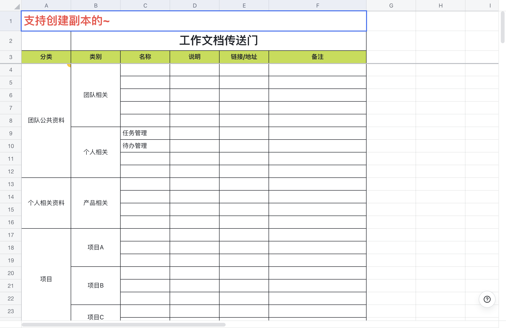

### 2、建立业务名词表（行业级）

目的是让你快速熟悉行业、公司的基础知识，这样在后面几周能快速融入日常业务讨论会

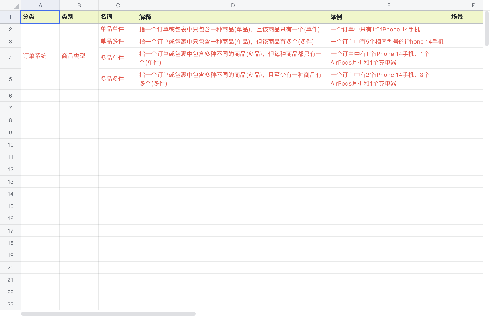

### 3、建立个人学习成长记录表

> **此表非常关键，是你能顺利融入团队、甚至提前转正的关键资料！**

| **sheet页**                               | **内容说明**                                                             |
| ---------------------------------------- | -------------------------------------------------------------------- |
| 新人融入计划表                                  | 一般是部门有模板，由mentor和leader确定阶段目标**主动问！如果没有，自己做一个（博主提供模版）。**             |
| 学习记录                                     | 记录你每天学习到的新知识、新技能、新方法                                                 |
| 问题记录                                     | 记录后面工作遇到/发现的问题、解决策略、解决行动、解决效果（**重点是那些无人解决的问题，这是试用期阶段的加分项**）          |
| 沟通记录                                     | 记录你和leader、mentor的 1 v 1 内&#x5BB9;**（每次 1 v 1的时候，就拿个人学习成长记录表和她们聊 ）** |
| 分享记录                                     | 记录你后期的学习分享（主题、过程、会议纪要等）                                              |
| 复盘记录                                     | 记录你的日/周工作复盘记录                                                        |
| **关键点；这个表一定要发给leader、mentor，让他们知道你在行动。** |                                                                      |

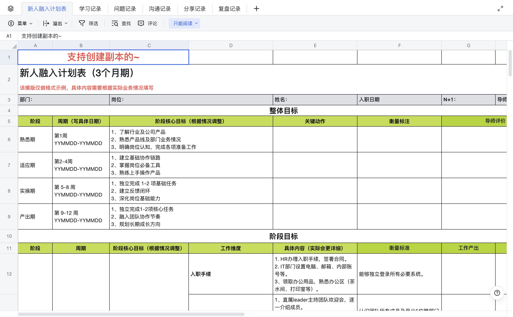
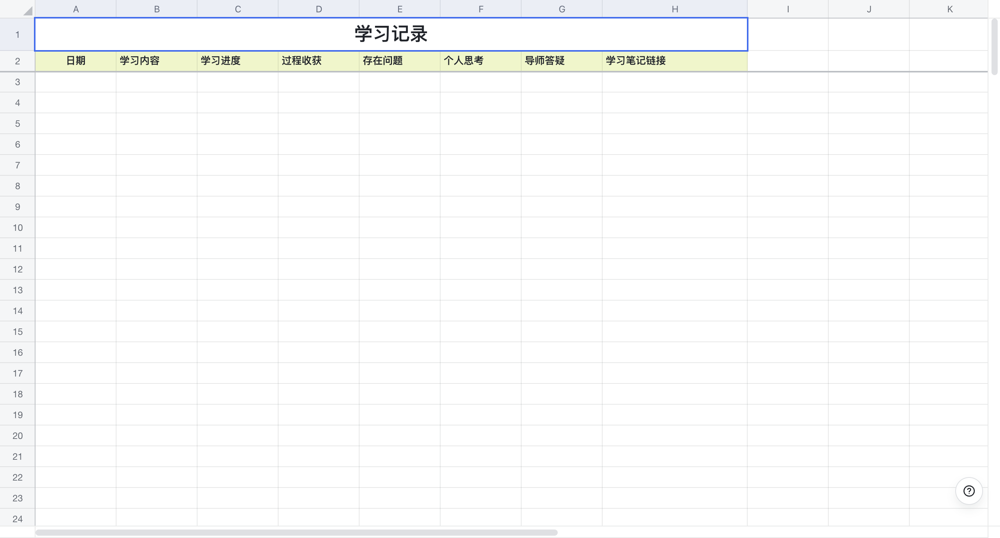
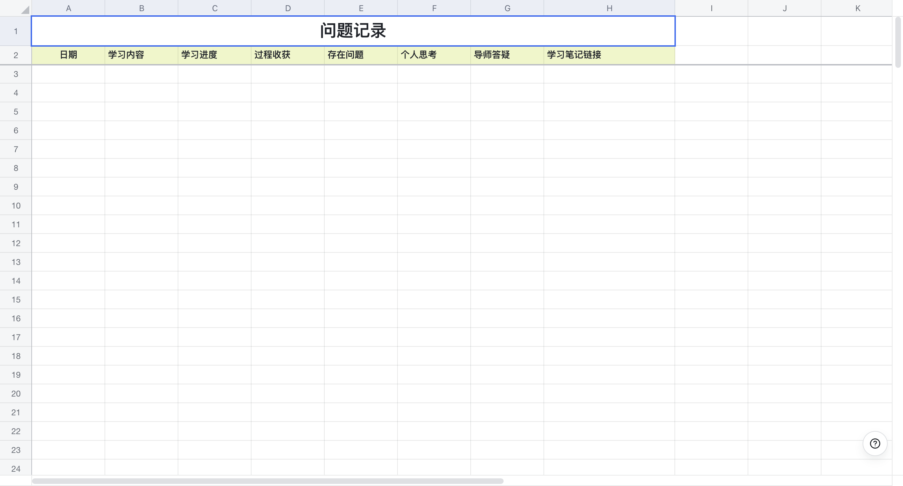
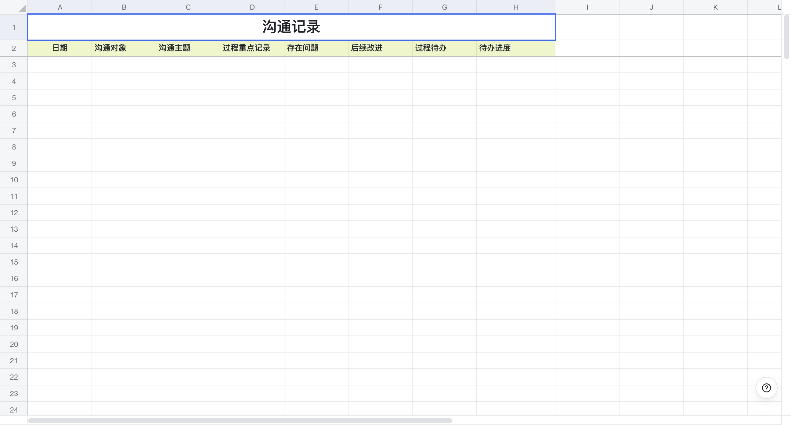
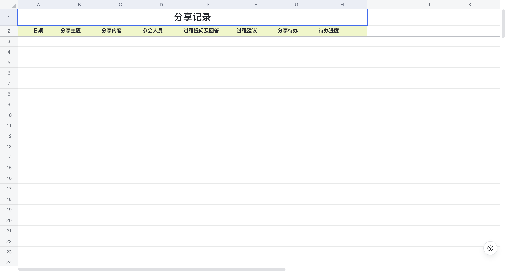
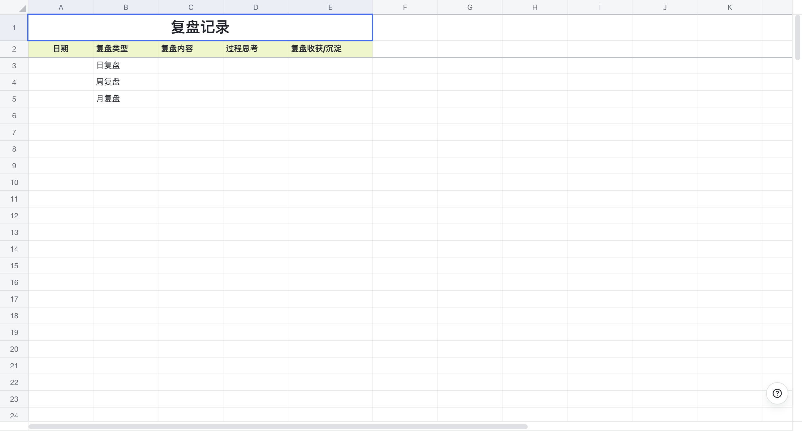

### 4、建立个人任务管理看板

对于新人来说非常实用，有三个作用！

> **1、可以让你清楚自己当前手头有哪些工作，都是什么进度！**
>
> **2、接受任务时，能快速识别当前能否插入？如果插入会影响什么！**
>
> **3、特别是和mentor、leader进行 1 v 1 的时候，可以快速拉出工作成果和进度。**

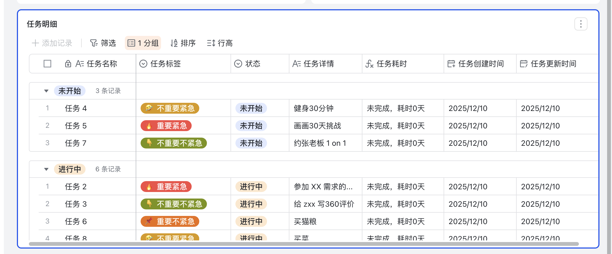

### 5、建立团队人员关系表

> 摸清团队里面的人事关系图，这里面猫腻比较多，做这个算是社会化的一部分。

有4个目标

> **1、清楚都有谁在管你（实线+虚线），实线往往1个就是N+1，虚线可能会多**
>
> **2、谁会影响你转正（工作对接最多的人：虚线、mentor、上下游合作团队成员）**
>
> **3、团队每个人的长处和短处（学习和帮助他人）**
>
> **4、上述人员的基本信息：老人/新人（入职时间）、是否嫡系、性格特点、做事风格、城府深浅、最强能力（leader最看重的）**

注意：这个表比较私密，不能被其他人看到，尽量只在手机-个人账号中打开，不要放在公司账号里。

模版：[ 团队人员关系表](https://z3siac1eca.feishu.cn/wiki/U26KwzoJAi3gfwkxuTucQXQlnld?from=from_copylink)

### 6、建立日报/周报记录表

> 一般公司都会要求员工写日报、周报，其中日报多是办公软件自带功能、周报多是邮件。

入职第一周得摸清楚这个要求，然后不管是哪种形式，给自己建立一个日报/周报记录表。

**使用方法：先在日报记录表里写清楚，检查无问题后，再复制粘贴到办公软件。**

注意：后面会有单独章节讲怎么写日报、周报

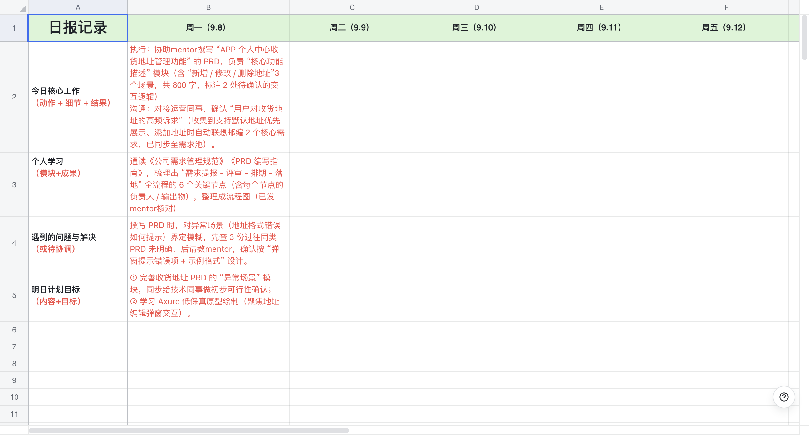
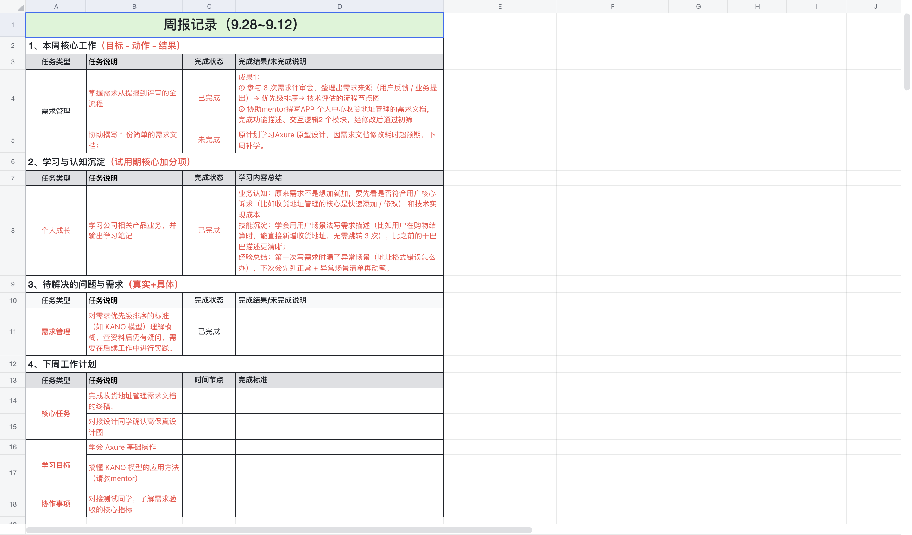

### 7、建立个人岗位手册

> 职场中 80% 的问题都是 “重复性” 的！
>
> 所以一定要让 “经验” 变成 “可复用的工具”！

**核心价值是 “减少重复劳动，降低犯错概率”**

> 记录什么
>
> 业务类：把模糊规则变成清晰步骤
>
> 协作类：让找谁做事不再靠问
>
> 避坑类：把踩过的雷变成以后的提醒

尤其对试用期员工来说，手册是快速成长的加速器，当你能随时调取 “客户报价流程”“会议注意事项” 这些信息，leader和同事会觉得你 “上手快、很专业”，好感度自然提升。

模版：通用性不大，所以暂时还没做。

### 8、建立你的AI虚拟团队

[ ✅产品AI大合集](https://z3siac1eca.feishu.cn/wiki/ICFYwAMDwibS4gkc3NscSFwDnsc?from=from_copylink)

[ ✅免费工具合集](https://z3siac1eca.feishu.cn/wiki/NguXwMH2qiSdE6kK7Sxco8G5nab?from=from_copylink)

[ 教程 | 扣子从入门到精通](https://ncnlnt2dfp74.feishu.cn/wiki/BnXcwZPKViHO4lkdprNc0q8AnCy)

## 四、一定要给自己立人设

入职第一周，别只想着不要出错。

你以为leader在看你是不是听话，其实他在观察你能不能快速适应环境 + 自主快速学习。

很多人前7天一脸懵，每天不知道做什么，日周报也不知道怎么写，最后在leader眼里留下一个差评。

正确做法，**是给自己立一个「有方法、主动学习、能快速上手」的人设**

### 1、怎么算有方法？

持续让leader看到你的工作节奏和方法。

**比如第一周建完上述6张表（其实有12个），同时真正落地实践。**

**你就会给leader、mentor建立一个初步印象：这人做事不慌，有章法！**

### 2、什么是主动学习？

很多人入职后都会学习，但你不说别人看不到！看不到就不知道！

> 真实案例：
>
> 上班多年，见过最卷的一位新人，从入职第二天开始，试用期期间每天晚上9-11点发今日学习邮件（格式多是思维带图，**带学习内容、带过程思考、带发现问题、带解决思路**），抄送团队全员。

所以，一定要让你的学习留痕有记录，证明你在主动学习。成果就是下面2张表。

**1、个人学习成长记录表-学习记录**

**2、业务名词表（行业级）**

注意：如果你觉得自己能力很强，可以把参考案例里面的新人，每天发邮件，直到转正！

### 3、如何能快速上手？

**上手的标准：这活交给你放心。**

所以一定要认真对待每一个工作任务！

记住：试用期间完成不是目标，做事过程才是关键，这能证明你的潜力。

> 学员一个真实案例，内容太多，加了文档
>
> [ 未命名页面](https://z3siac1eca.feishu.cn/wiki/CLt0wKXWZiGDKik6oJ2cYpPinHf)

一定要看完案例，接下来再看**任务接收方法。**

> **做每一个任务时，都需要做透、做深，要把你的过程量化！**
>
> 1、明确任务优先级（四象限法则）
>
> 2、理解任务达成标准（时间、交付要求、区别理解认知一致）
>
> 3、动手分解执行动作（确保这事自己能不能做）
>
> 4、识别提出资源诉求（发现不能做的找资源）
>
> 5、提前预判潜在风险（提前发现风险就尽早沟通）
>
> **要求：前期可以是领了任务回到工位思考，后期技能熟练了，当场就可以给出大概结果**

| **步骤**     | **具体实操**                                                                                                                                                                                                        |
| ---------- | --------------------------------------------------------------------------------------------------------------------------------------------------------------------------------------------------------------- |
| 1、明确任务优先级  | 这个问题的前提是手里有任务了（在实习期间可能少见，但正式工作后属于常态化，就是你手里有多个工作，但leader还会临时给你安排活，这个时候就必须问清楚优先级）                                                                                                                                 |
| 2、理解任务达成标准 | **时间：**&#x662F;绝对截止时间（如错过就作废）还是弹性时间（可协商延后）**交付标准：**&#x683C;式、内容、质量都要细化**相关方认知一致：**&#x4E00;个任务可能涉及多个角色（如执行者、审核人、最终用户），需确认大家对标准的理解是否统一这个是减少返工的必备动作，不问清楚做出来容易被推翻标准越模糊，坑就越深。宁愿多花 5 分钟追问细节，也别用 5 小时为「想当然」买单。         |
| 3、动手分解执行动作 | 确保这事自己能不能做以案例中的设计产品宣传页为例：1、搞清楚背景、场景，是和leader拉齐还是和其他人？2、搞清楚产品宣传页的形式，是DM单，还是宣传册。从而明确内容诉求，是纯文本还是文+图3、内容的审批定稿人是谁？leader还是xx4、对接设计师是谁？她期望什么时候交付，什么形式交付（给文档、还是线下对接or开会）5、是否需要参加设计稿评审（后续工作）说明：3拆的越细，才能发现4需要什么资源，5有什么风险 |
| 4、识别提出资源诉求 | 人员、时间、预算、工具/设备                                                                                                                                                                                                  |
| 5、提前预判潜在风险 | 参考过去同类任务；有解法制定Plan BC；无策略提前沟通                                                                                                                                                                                   |

**如果第一周接到的任务，都能按照上述方法去执行，一定会给leader留下好印象！**

> **关键点：**
>
> **上面方法能避免你成为「执行型劳动力」，而是被当成「有思考能力的人」，哪怕你做得慢，别人也愿意教你！**

## 附1：注意事项合集

### 1、避免边缘化

> **主动是性价比最高的职场投资！**&#x20;
>
> 不主动就会错过“被看到”的机会，被动等不会让你变得“成熟”，只会慢慢变“隐形人”。
>
> **请教不是示弱，是建立关系的第一步**
>
> 职场社交的底层逻辑是：谁向你请教、你对谁提供帮助，就容易建立信任。
>
> **没有人有义务来发现你，只有你能让自己被发现**
>
> 别等着“带你的人”主动来问你有什么不懂，你要主动频繁去连接。

### **2、多听少说**

> **新人刚入职，容易犯两个极端的错**
>
> 要么太胆小，啥都不敢问，明明不知道打印机怎么用，也硬着头皮瞎试，结果越弄越乱；
>
> 要么太想表现，还没搞懂公司情况，就到处提建议，比如「我觉得咱们这个流程太麻烦，应该改改」。
>
> **特别是后者，简直是在雷区蹦迪，炸死一个是一个**

### **3、称呼同事**

> **每个公司的称呼习惯不一样，别瞎猜**
>
> 外企一般都喊英文名，比如 “Lisa”“Mike”，直接跟着叫就行（但称呼leader建议加个哥、姐；如果明明说不用叫后面就可以取消。）
>
> 国企或大公司通常叫职位，比如王经理、李总，就算是副经理，也别带副字，说话好听点
>
> 互联网公司比较随意，听同事怎么叫，大家喊张哥、刘姐，你也跟着这么叫，错不了
>
> **千万不要直呼姓名，除非你们本来就很熟。**

### **4、下班怎么走**

> 第一天别第一个走，先看看大家的节奏。
>
> 有的公司到点大家起身就走，那你也可以准备走；有的可能到点先去吃饭，回来继续加班，这时候别跟着瞎走，等大多数人开始收拾东西了再动。
>
> 走之前跟leader打个招呼，比如：x哥/姐，今天没什么事的话，我就先下班了；一般leader都会说：行，走吧。
>
> **也别故意留到最后，显得太想表现，反而让老员工觉得不自在。**

**有需要可扫码加好友（备注飞书），博主期待和更多同学交流。**

微信号：zhizhiqian1

# 第2章：日报、周报：你写了吗？写了什么？

**重视日报、周报，是让leader及时看到成果的最佳途径**

每个公司对日报、周报的要求不一样，有的让写，有的不让写。

**但是作为作为试用期的你，不管是否要求，你都要写！**

## 一、日报：让leader知道你在状态、能做事

> 日报的前提是工作计划！

### 【工作计划】每日整理任务清单，确保无遗漏、未到 deadline

通过优先级排序聚焦核心任务，避免因 “遗忘次要任务” 或 “临近截止才动手” 导致的工作失误。

### 【实操方法】计划刷新+工具选择

* **计划刷新**：早上花 10 分钟刷清单，按 “紧急重要＞重要不紧急＞紧急不重要” 排序，标注每个任务的deadline 和交付标准

* **工具选择**：简单场景用 “纸质待办本”，复杂场景用办公软件，设置 “提前提醒”（如 deadline 前 1 天弹窗）。

### 【避坑关键】聚焦核心+灵活调整

别列 “过多任务”（每日核心任务控制在 3-5 项），避免因完不成产生挫败感；

灵活调整优先级，比如临时插入紧急任务时，先确认原有任务是否可延期。

### **【实操技巧】日报四件套结构**

> **本节内容带你实操：日报结构化、可复用模版**
>
> > 很多人写日报都是今天干了xxxx，列个1、2、3、4、5；明天计划干12345
> >
> > **leader看完不知道进度是多少？中间有问题？是否需要资源协助**
> >
> > 这根本原因是你没有掌握结构化思维！
> >
> > 所以这节教你：**怎么借助结构和模板，把你一天的工作说清楚，让leader看到你的做事状态！**
> >
> > **【核心工作 + 个人收获 + 解决问题 +  明日计划】**

| **今日核心工作****（动作 + 细节 + 结果）** | 执行类：做了什么任务 + 完成进度 / 结果辅助类：配合谁做了什么 + 产出物”（体现协作性）                       |
| ---------------------------- | --------------------------------------------------------------------- |
| **个人学习****（模块+成果）**          | 学习类：学了什么内容 + 掌握程度                                                     |
| **遇到的问题与解决****（或待协调）**       | 有解决方案：问题 + 自试方法 + 最终方案（体现独立解决能力）无解决方案：问题 + 已尝试的方向 + 需要的支持（体现主动思考，不甩锅） |
| **明日计划目标****（内容+目标）**        | 聚焦 1-2 个核心重点（别列 5 条以上，显得无优先级）关联学习 / 执行，比如完成 XX 流程的实操练习，同步向mentor核对结果。 |

**【案例分享】**

> 1 年工作经验的产品经理
>
> **今日核心工作：**
>
> 执行：协助mentor撰写 “APP 个人中心收货地址管理功能” 的 PRD，负责 “核心功能描述” 模块（含 “新增 / 修改 / 删除地址”3 个场景，共 800 字，标注 2 处待确认的交互逻辑）
>
> 沟通：对接运营同事，确认 “用户对收货地址的高频诉求”（收集到支持默认地址优先展示、添加地址时自动联想邮编 2 个核心需求，已同步至需求池）。
>
> **个人学习**
>
> 通读《公司需求管理规范》《PRD 编写指南》，梳理出 “需求提报 - 评审 - 排期 - 落地” 全流程的 6 个关键节点（含每个节点的负责人 / 输出物），整理成流程图（已发mentor核对）
>
> **问题与解决**
>
> 撰写 PRD 时，对异常场景（地址格式错误如何提示）界定模糊，先查 3 份过往同类 PRD 未明确，后请教mentor，确认按 “弹窗提示错误项 + 示例格式” 设计。
>
> **明日计划**
>
> ① 完善收货地址 PRD 的 “异常场景” 模块，同步给技术同事做初步可行性确认；
>
> ② 学习 Axure 低保真原型绘制（聚焦地址编辑弹窗交互）。

**【发送时间】**

> 早于9点就在9点左右发，晚于9点下班时发！
>
> 要是当天忘了，一大早起来就赶紧发！

## 二、周报：让leader知道你会思考，有计划、有结果

你每周写的周报，是你自己“登台说话”的唯一渠道。

有人写周报只是交差，有人写周报在建立存在感。

有人写周报是在锻炼表达力、锻炼思维力，最终把自己“写进晋升通道”！

> **本节内容带你学习：周报作用、价值输出、结构化表达、可复用模板**
>
> > 日报和周报的本质是一样，都是给leader看你的工作。
>
> > 但差异点在于：**日报是看过程，周报是看结果**
>
> > 所以周报不能像日报那样写成流水账，而是应该主次分明！
>
> > 这节教你：**怎么借助结构和模板，把你这一周说清楚、说出价值感。**

### **【周报作用】个人工作管理工具**

> 很多新人以为周报只是“写个总结”，其实它还有更深的意义：个人工作管理工具。
>
> **帮助leader对齐认知**
>
> 你的周报不是单向汇报，而是告诉leader:我在做这些事，我的理解是这样的，请确认我的方向是否正确。
>
> 这样能大大降低“方向跑偏”的风险。
>
> **减少团队内部沟通成本**
>
> 周报写清楚，团队就少了很多重复对接。
>
> 别人知道你在推进什么、需要什么支持，效率自然提升。
>
> **锻炼自己结构化思考**
>
> 每次写周报，你其实在做一个小型复盘。
>
> 它会迫使你去想：这周到底干了什么？有价值吗？做得对不对？写得久了，你会发现，周报变成了自我管理的利器。

### **【周报写法】从事实到价值**

> 周报和写作是同一个道理，同样的故事，有些人讲出来就很有故事感、很有价值。
>
> 所以，本质是表达方式的升级！
>
> **三步进阶写法**
>
> **写事实：**&#x6211;做了A、B、C（这种写法最像流水账，别人读完没有抓手）
>
> **写贡献：**&#x6211;做了A，解决了X问题（已经开始转化为成果导向）
>
> **写价值：**&#x6211;做了A，解决了X问题，带来Y收益，对团队/客户的意义是Z（这就是高手周报，能让别人立刻看到工作价值）

### **【实操技巧】周报四件套结构**

> **不写“我做了什么”，而是写“我做成了什么”**

| **本周核心工作****（目标 - 动作 - 结果）**    | 先明确本周目标再写具体动作和量化结果若有未完成的，说明原因 + 补做计划                         |
| ------------------------------- | ------------------------------------------------------------ |
| **&#x20;学习与认知沉淀****（试用期核心加分项）** | 业务认知：对公司业务 / 岗位价值的新理解技能沉淀：掌握的新技能 + 应用场景经验总结：做得好 / 不好的地方 + 原因 |
| **待解决的问题与需求****（真实+具体）**        | 问题要聚焦成长卡点需求要可落地，而非想要更多资源                                     |
| **下周工作规划**                      | 分核心任务、学习目标、协作事项3 类，每类 1-2 项（避免贪多）明确交付标准明确需要谁支持/协同            |

**【案例分享】**

> **产品经理岗（试用期第 4 周，核心在理解需求流程）**

| 本周核心工作（目标 - 动作 - 结果） | 目标1：掌握 “需求从提报到评审” 的全流程，协助撰写 1 份简单的需求文档；成果1：① 参与 3 次需求评审会，整理出 “需求来源（用户反馈 / 业务提出）→ 优先级排序→ 技术评估” 的流程节点图② 协助mentor撰写 “APP 个人中心‘收货地址管理’的需求文档”，完成 “功能描述”“交互逻辑” 2 个模块，经修改后通过初筛未完成：原计划学习Axure 原型设计，因需求文档修改耗时超预期，下周补学。 |
| -------------------- | ------------------------------------------------------------------------------------------------------------------------------------------------------------------------------------------------------------- |
|  学习与认知沉淀（试用期核心加分项）   | 业务认知：原来需求不是想加就加，要先看 “是否符合用户核心诉求（比如收货地址管理的核心是快速添加 / 修改） 和技术实现成本技能沉淀：学会用 “用户场景法” 写需求描述（比如用户在购物结算时，能直接新增收货地址，无需跳转 3 次），比之前的干巴巴描述更清晰；经验总结：第一次写需求时漏了异常场景（地址格式错误怎么办），下次会先列正常 + 异常场景清单再动笔。                           |
| 待解决的问题与需求（真实+具体）     | 对需求优先级排序的标准（如 KANO 模型）理解模糊，查资料后仍有疑问，需要在后续工作中进行实践。                                                                                                                                                             |
| 下周工作规划               | 核心任务：完成 “收货地址管理” 需求文档的终稿，配合设计同学确认原型学习目标：学会 Axure 基础操作，搞懂 KANO 模型的应用方法（请教mentor）协作事项：对接测试同学，了解需求验收的核心指标                                                                                                        |

## 三、其他类型的周报模版

| **类型** | **适合岗位**                | **汇报结构**                                                                                   |
| ------ | ----------------------- | ------------------------------------------------------------------------------------------ |
| 任务型    | 适合流程清晰、有明确指标的岗位（如运营、销售） | 本周工作回顾 - 任务名称：目标 → 实际结果（用数字量化）遇到的问题与思考 - 遇到的问题+个人尝试的解决方案下周计划 - 任务清单 + 协同需求                 |
| 项目型    | 适合参与项目/方案制定类的新人（如产品/策划） | 本周进度（按照项目时间轴） - 项目节点 + 当前状态 + 完成情况项目推进中遇到的风险点与建议 - 问题识别+下一步计划我的成长/反思 - 本周新掌握了哪些能力/工具       |
| 初入职型   | 适合入职不到1个月的新人，重点是展现学习能力  | 本周重点任务/学习内容 - 我参与了哪些项目/了解了哪些流程我的疑问与理解 - 哪些地方还不清楚/哪里学会了新的逻辑下周想要深度参与的方向 - 想请谁带带我 / 想观察谁的工作方式 |

## 四、周报的复利效应

一开始，你可能觉得写周报只是任务，但长期坚持，会看到明显的变化

**1、表达力提升：**&#x4F60;能把复杂的事讲清楚，这本身就是职场核心竞争力

**2、思维力提升：**&#x6BCF;周逼自己做复盘，你自然养成结构化思考的习惯

**3、影响力提升：**&#x8001;板会觉得你靠谱，慢慢把更重要的事交给你

**4、职业资产积累：**&#x4E09;个月周报是一份成长档案，一年周报是一份系统化简历。

## 五、日报、周报踩坑

带团队开日会、周会，遇到最常见的几个踩坑问题：

**1、任务出现明显遗漏**

**2、任务频繁延期但没有原因**

**3、任务需要他人协助，但没提前沟通**

## 六、周报被大leader看到才有价值

> 注意：是大leader，因为你的leader一般会参加周会，所以固然会被看到，但你的大leader不会参加。
>
> 真实案例：
>
> **产品线总经理在开每周部门leader例会时，拿出某一线员工的周报当面表扬，说这个新人写的周报逻辑非常清晰！**

**1、抓住黄金时间：**&#x770B;团队加班情况，如果周六周日也加班（在家也算），那就在周日晚上发！如果不加班，那就在周五下班前发！

**2、固定周报主题：**&#x540D;字+周报+时间段（示例：王二周报：2025.9.22\~2025.9.26）

**3、固定周报格式：**&#x6B63;文建议用表格呈现，比全是文字阅读体验会好很多很多！

**4、周报抄送对象：**&#x4E;+2、N+1、团队成员、合作项目组

## 七、博主真实案例

我做leader发的第一份周报，拆分了团队、个人两个维度，然后按照上述模版详细写了很多东西。

周报发出去不到1小时，收到了大leader回信：说我逻辑很清晰，通过周报能看到团队目标达成情况，个人成长情况！把团队交给我带很放心！

从那以后我就明白，**leader对你的考察分布在各个地方，这些加起来，最后就会形成对你的能力评估，然后判断你值不值得被托付更大的活。**

**有需要可扫码加好友（备注飞书），博主期待和更多同学交流。**

微信号：zhizhiqian1

# 第3章：入职8-14天：别人讨论你能插上话，并提出有效建议

> 大部分公司，新人在入职第2周、第3周就会开始介入具体业务性工作！

## 一、常见翻车行为（避坑清单）

### 1、别人开会、讨论说的行业名词，你一个都听不懂

> **问题本质：**&#x8FD9;是新人或跨领域从业者最易遇到的“信息断层”问题，核心是缺乏对行业基础术语、专业缩写、业务黑话的积累，导致无法接入团队的信息交流频道。
>
> **具体影响**：不仅会直接跟不上讨论节奏还可能错过关键任务要求、决策依据，甚至因不敢追问而被动放弃参与，长期下来会拉大与团队的业务认知差距。

### 2、没听懂别人说的意思，又着急表现提建议

> **问题本质**：根源是“证明欲盖过了理解力”，既怕被认为“能力不足”，又想快速展现积极性，导致在未明确对方核心诉求、背景逻辑的前提下盲目输出。
>
> **具体影响**：提出的建议往往偏离问题核心，不仅无法起到帮助作用，还会暴露“不严谨”“抓不住重点”的问题，甚至可能打乱原有工作节奏，消耗同事/导师的沟通成本。

### 3、和导师、同事缺少互动，成为团队小透明

> **问题本质**：多因“怕打扰别人”“社恐不敢开口”或“觉得做好自己的事就行”，忽略了职场中“信息同步”和“信任建立”需要主动互动支撑。
>
> **具体影响**：导师可能因不清楚你的进展和卡点，无法及时提供指导，导致你走弯路；同事在分工、协作时容易忽略你的存在，错失参与核心任务的机会；长期缺乏连接会让你难以融入团队文化，甚至在评估时被认为“缺乏协作意识”。

## 二、怎么破局？给你一套标准打法！

### 1、持续学习和更新业务名词表

完成第一版后，要坚持学习+持续更新！

**怎么学习：**&#x4E0A;班后第一时间先把业务名称过一遍，难记的标记出来多看几遍！

**怎么更新：**&#x6BCF;次讨论、开会遇到新名词，下来就查清楚，补充进去！

### 2、一定要动手画业务流程图

特别是互联网行业，开发相关岗位（产品、测试、开发、运营等），一定要画业务流程图！

业务流程图是 “逻辑翻译器”，能将抽象的业务逻辑转化为可视化路径，既帮自己梳理环节漏洞，也让跨岗位协作时快速对齐认知，避免 “各说各话” 的沟通内耗。

> 实操案例
>
> **产品岗**：聚焦 “核心用户路径”，比如画 “用户从注册到下单的全流程”，标注关键节点（如验证码校验、支付跳转）和异常分支（如支付失败重试），为需求文档提供落地依据。
>
> **测试岗**：侧重 “用例覆盖流程”，结合流程图拆解测试场景，避免遗漏 “边界环节”（如超时未支付自动取消订单），提升测试用例的完整性。
>
> **开发岗**：聚焦 “技术实现流程”，标注接口调用、数据流转节点（如前端请求→后端校验→数据库存储），提前规避逻辑冲突。
>
> **运营岗**：侧重 “活动执行流程”，比如画 “裂变活动的用户参与 - 奖励发放流程”，明确运营、技术、客服的协作节点，确保活动落地无断层。

**注意：不用追求全而细，优先画 “核心主流程”（80% 业务场景覆盖），再补充分支流程！目的是让自己懂的产品全貌！**

### 3、记录学习过程中的问题和收获

一定要持续完善【个人学习成长记录表】

避免学完就忘、重复踩坑，将碎片化的学习体验转化为可复用的 “个人知识资产”，同时为后续复盘、汇报提供素材支撑！

**关键点：别只记答案，重点写 “思考过程”；避免流水账，聚焦 “有价值的问题”（比如反复卡壳的点、颠覆认知的收获）。**

### 4、硬件行业一定要操作实物；软件行业必须操作软件

脱离实操的学习是 “纸上谈兵”，实物 / 软件是行业知识的 “具象载体”，只有亲手接触才能理解核心逻辑、发现隐性问题。

**踩坑点：别只停留在 “会用”，要追问 “为什么这么设计”（比如软件某功能设为弹窗而非跳转，背后的用户行为逻辑是什么）。**

### 5、主动向导师、同事请教问题，展现好学、虚心请教行为

导师 / 同事的经验是捷径，能帮你跳过行业 “隐形坑”！

同时，主动请教是传递 “积极融入、愿意成长” 信号的关键，能快速建立职场信任。

> 实操方法
>
> **请教前准备**：先做 “基础调研”，带着 “具体场景” 提问
>
> **请教时表达**：用 “闭环式提问”，比如 “关于 XX 问题，我查了 XX 资料，尝试了 XX 方法没解决，您能帮我看看哪里有问题吗？”，体现自己的思考。
>
> **请教后反馈**：按建议解决问题后，主动同步结果，让对方感受到 “建议有价值”。

**注意：别过度依赖（同一类问题不重复问），也别不分时机（避免在对方赶项目 deadline 时打断请教）。**

### 6、准备学习汇报PPT（没要求也要主动发起）

> 具体实操见第五章内容

汇报不是 “任务交付”，而是 “主动展示成长 + 获取反馈” 的机会。

即使leader无明确要求，主动发起也能让导师 / 团队看到你的思考深度，还能通过他人建议校准学习方向。

## 三、附工作方法\&SOP

### 1、业务学习九步法

**带新人久了会发现：试用期能不能稳住，关键不是有没有耐心学，而是会不会找方法学。**

> 见过应届生入职两周就把产品逻辑捋得门清，也见过工作两年的新人，试用期快结束了还说不清「自己负责的功能到底解决什么问题」。
>
> 把自己带人的经验拆成了9个步骤，总结&#x6210;**「产品业务学习方法」**。
>
> 能顺着方法往下啃的新人，基本两周就能独立对接需求，试用期通过率提了一大半；
>
> 而对着方法还摸不着头脑的，往往是没找对学习节奏，只能靠「野蛮生长」慢慢磨。

下面九步从「是什么」摸到「为什么」，再到「能怎么优化」，由浅入深地把业务嚼透。

| **顺序** | **核心**  | **说明**              |
| ------ | ------- | ------------------- |
| 1      | 【产品定义】  | 这个产品/功能是什么          |
| 2      | 【产品链路】  | 通过哪些软、硬件产品实现业务全链路   |
| 3      | 【需求背景】  | 为什么要做，背后的根因到底是什么    |
| 4      | 【用户角色】  | 都是谁在用，他们有哪些产品使用习惯   |
| 5      | 【应用场景】  | 什么情况下用，希望有什么样的操作感受  |
| 6      | 【目标诉求】  | 解决什么问题或者满足什么需求      |
| 7      | 【业务价值】  | 带来什么收益？是给客户还是给公司    |
| 8      | 【竞品分析】  | 竞品哪些地方做的设计和体验更优秀    |
| 9      | 【优化建议】  | 有没有更好的方案、设计、交互      |

###

**有需要可扫码加好友（备注飞书），博主期待和更多同学交流。**

微信号：zhizhiqian1

# 第4章、入职0-30天：建立leader信任感

> **你有没有这种感觉？**
> &#x20;明明没有犯错，却总觉得leader对你有些看法
> &#x20;想主动表现又担心leader觉得你急功近利？
> &#x20;一句最近工作进展怎么样？都让你神经紧绷

如前文案例所说：leader会通过周报评估你的工作能力，同样也会通过其他细节评估，比如做事风格、沟通方式、汇报逻辑等，去持续的给你打分！

而这个打分：基本在第一个月就完成了！

也就是说，**第一个月，leader已经对你做了基本判断！行还是不行！**

> 因此：本章目标
>
> 如何让你在试用期前30天，不内耗、不浮夸地拿下老板的信任感，让他觉得你“上道了”。

## 一、为什么一定要建立信任感？

它决定了你的工作自由度、资源获取效率、风险容错空间，甚至是长期职业天花板！

### **1、获取核心资源的入场券**

> leader作为团队资源（项目机会、培训名额、预算权限、核心协作方链接）的分配者，其决策本质是风险与价值的权衡，而信任感直接降低了他对你的 “交付风险预判”。

### **2、获得工作自由度**

> 职场效率的核心差异，在于 “决策自主权” 的大小，而自主权完全建立在leader信任的基础上。
>
> **缺乏信任时：**&#x6C;eader会陷入过程管控模式，比如要求你及时同步进度、每步操作需审批，甚至推翻你已完成的工作重新调整。
>
> **建立信任后：**&#x6C;eader会转向结果导向管理，给予你更大决策空间。这种自由度既能提升工作效率，更能锻炼你的全局思维，为后续承担更大责任铺路。

### **3、风险容错的安全垫**

> 没有任何人能做到 “工作零失误”，但leader的信任感会决定失误后的走向，是 “被否定” 还是 “被指导”。
>
> **无信任基础时：**&#x4E00;次小失误可能被放大为 “工作不严谨、不可靠”，甚至影响后续的任务分配；若遇到突发问题，leader更倾向于替换负责人而非协助解决。
>
> **有信任基础时：**&#x6C;eader会默认你的失误是 “能力不足” 而非 “态度问题”，更愿意提供解决方案，这种容错空间是新人试错成长的关键，也是资深员工敢突破创新的底气。

### **4、职业晋升门槛**

> 晋升的本质是leader对你的担责能力的认可，而担责能力的核心就是 “信任感”，leader需要确认 “把团队 / 更重要的任务交给你，不会出问题”。
>
> > 真实案例：
> >
> > 能力强但不晋升：有个下属技术过硬、任务完成度高，但因缺乏信任度（平时汇报时只报喜不报忧、遇到问题隐瞒不报），评价是缺乏责任心、无法把控风险，根本不敢将管理岗或核心岗交给 TA。

## 二、哪些行为会打破信任感？

### 1、被动等待工作安排

**新人最容易出现的问题：**&#x628A;分配任务当作工作的唯一启动信号，缺乏主动挖掘工作、寻求工作的意识

> 常见表现
>
> 入职后，仅完成leader明确安排的整理文件、录入数据、做xxx事的任务，当任务间隙无新指令时，便无所事事刷手机、聊八卦，从未主动询问团队当前有哪些紧急需求、我能协助做些什么

### 2、着急频繁出错

急于表现、抢活、独立完成任务，把速度当效率，结果因急于推进而频繁出现低级失误。

> 真实案例
>
> leader安排某项工作，新人仅用 30 分钟完成就提交了，文档中多处出现明显错误，leader指出错误，新人辩解想尽快完成任务。

### 3、过于沉默没有存在感

有的新人担心自己太多话会“越级”或者“抢戏”，于是选择了沉默，很少主动同步工作状态、暴露问题、表达想法，导致leader对你的工作进展、能力边界形成认知盲区。

> 结果：明明做了很多，却没人知道，表达方式太委婉，让人听不出重点，永远等别人来提醒你做什么。

### 4、日常工作甩锅

**新人重大踩雷项**，将个人失误 / 协作问题习惯性归因于他人、环境或资源，回避自身责任。

> 案例
>
> 与同事协作完成竞品分析报告，新人负责的 “市场数据部分” 遗漏关键信息，导致报告被驳回，复盘时新人立刻说 “他没提醒我要加最新季度数据”“给我的资料不全”，绝口不提自己未主动确认数据时效。

### 5、越级沟通

**新人不想干系列，**&#x4E3B;动绕过N+1，直接向更高层级汇报工作、提需求或反馈问题，且未提前同步直属leader。

这个点大家应该都懂，就不细说了，平常注意就行。

### 6、传播负面情绪

试用期将个人对工作、决策的不满转化为公开抱怨、私下吐槽或消极抵抗，影响团队氛围。

> 职场没有秘密。你的私下吐槽，会经过别人的加工传到当事人耳朵里，特别是leader耳朵里。

### 7、口号多行动少

语言巨人与行动矮子！日常工作上特别喜欢喊口号，动不动就立下目标、承诺成果，结果最后又做不到，最后还是leader同事给收拾烂摊子。

> leader安排调研竞品新功能，你立刻回应 “保证三天内出详细报告，包含功能拆解、用户反馈、落地建议”，但三天后仅提交 “简单功能罗列”，且多处信息错误，不是时间不够，是根本没有这个能力。

### 8、工作思考太少

推一步动一步，将工作定义为完成明确指令，而非对结果负责，缺乏主动预判需求、补位漏洞的意识。

> 案例
>
> leader安排 “整理产品用户反馈”，仅罗列原始评论提交，既不按 “功能问题 / 体验建议” 分类，也不标注高频反馈点；leader追问 “核心问题是什么”，才回头补做分类，且全程未询问 “反馈需用于版本迭代还是需求调研”。

## 三、建立信任感的实操SOP

leader的信任感不是讨好得来的，而是通过持续的可靠行为积累！

### 1、任务输入SOP

很多新人不是能力不足，而是在接受任务时埋下了坑，要么分不清任务轻重，要么对标准含糊其辞，最终导致出力不讨好。

**实战方法：回顾之前的任务接收方法**

> 1、**明确任务优先级**（四象限法则）：为了不耽误关键事
>
> 2、**理解任务达成标准**（时间、交付要求、区别理解认知一致）：为了少做无用功/返工
>
> 3、**动手分解执行动作**（确保这事自己能不能做）：为了确保能落地，能按时做完
>
> 4、**识别提出资源诉求**（发现不能做的找资源）：为了有条件把事做好
>
> 5、**提前预判潜在风险**（提前发现风险就尽早沟通）：为了有备无患

**这么做的目的是展现你的思考能力，告诉leader“我做事有方法”，这是leader愿意信任你的起点。**

当你养成**接任务先防坑**的习惯，就会发现：同样的工作量，你总能比别人做得更稳、更出彩！这是新人最容易提升职场竞争力的方法！

### 2、开工确认SOP

很多新人接到任务就闷头干，不管做出来的东西质量咋样，leader都会让你改来改去，原因千奇百怪，方向不对、颜色太跳，改到最后，其实跟你最初的版本差不了多少。

为什么leader要没事找事，因为ta在享受决策权力。

对他来说，任何一件工作在没有经过他的指导下而完美结束，那就是管理风险，因为后续发展不可控。

应该怎么请示：带&#x7740;**「两个选项 + 初步思考」**&#x627E;leader，让leader定方向做决策，有参与感。

> 案例说明：不是老板说一句你就去做，**而是你要先理解，然后出方案，最后再确认。**
>
> > 老板说：做个调研，看看竞品现在怎么做的
> >
> > **先弄懂：**&#x8C03;研是为了什么？是想学人家的功能，还是想做内容对比？
> >
> > **出方案：**&#x51C6;备2个表格，列出不同的分析维度
> >
> > **再确认：**&#x6C;eader，我出了2个方案，个人觉得A方案比较好，原因是xxx，想让您把个关
>
> 这样一来，老板就会觉得：“你不仅能听懂，还能做出我没明说但在意的部分。”

### 3、过程反馈SOP

很多新人喜欢闷头苦干憋大招，等leader追问才给反馈，然后就被扣上了「不靠谱」的帽子。

为什么leader要问进展，因为掌控感。

一件事情如果失去控制，伴随着就是风险，leader不担心你能否留下，只在意 ta 的位置和绩效。

应该怎么汇报：**「说进度 + 提问题 + 给方案」**，不仅体现你的思考和靠谱，还让leader掌控进度的同时还享受决策权。

> **小事情：**&#x5E72;完了，马上向leader反馈
>
> **大事情：**&#x505A;的过程中，每完成一阶段就主动汇报一次，哪怕只是个初步框架
>
> 话术：当前工作进展是xxx，中间遇到了xxx问题，我出了2个方案，建议选择A方案，原因是xxx

### 4、风险上报SOP

不少新人遇到工作高风险时，第一反应是先扛着，觉得说不定能自己解决、报上去反而显得自己没本事。

**但真正的职场老手，发现中高风险，会立即/提前上报N+1！**

这不是甩锅，是给leader留缓冲，给问题留处理余地，而不是等爆雷了再说。

> **高风险：核心是「影响范围广」或「补救成本高」**
>
> 1、影响「交付底线」的风险
>
> 2、涉及「钱和合规」的风险
>
> 3、可能「丢客户或伤口碑」的风险
>
> 4、连锁反应式的潜在风险
>
> **为什么要立即/提前上报？**
>
> 1、坑自己：小失误熬成能力污点，甚至影响转正
>
> 2、坑队友：一个人扛不住，全组跟着加班填坑
>
> 3、坑公司：小风险滚成大损失
>
> **风险上报SOP**
>
> 上报不是「喊救命」，得有章法
>
> 第一步：先抓核心，用1句话说清风险
>
> 第二步：补细节，说清你已做的和还差的
>
> 第三步：提方案，给至少1个可行的求助方向
>
> 第四步：盯跟进，主动同步进展和新情况
>
> 话术：leader，我们遇到了一个挑战\[简述]。我分析了两个解决方案：A方案...B方案...我倾向于A因为...您觉得如何

> 真实案例1：
>
> 之前部门有个项目组长老郑，就栽在「分不清风险等级」上。
>
> 客户明明在沟通中提了「方案要大改，否则可能不签」，他觉得「客户只是随口说说」，没上报，自己闷头改了两版。
>
> 直到离签约只剩3天，客户明确说「不改方向就终止」，他才慌了神上报——这时leader想协调资源调整方向都来不及，项目最终黄了。
>
> 事后leader说：客户提「可能不签」时就是高风险信号了，哪怕只是可能，也该提前报，至少能多留几天缓冲。

> 我所在的行业里有个知名案例：
>
> 某公司销售隐瞒「大客户要解约」的消息，想着「自己再努努力挽回」，结果客户转头和竞品签了独家合作，不仅带走了每年2000万的订单，还把公司的核心服务模式透露给了竞品。
>
> 一个人的「硬扛」，给公司造成了难以挽回的损失。

### 5、请示结果

很多新人按照leader意见做完肯定没问题，就直接交差了，然后leader知道后一顿说教。

为什么leader要确认最终结果，因为信息断层、变数太多，谁知道会不会有坑没填。

因为最终拍板必须是leader亲自指示，就好像签字报销leader得签字一样。

应该怎么请示：**「修改点 + 待定点 + 请拍板」**，要有让leader觉得“事情是他办的”的感觉。

> 案例
>
> > leader，按您说的把引流渠道换成抖音了，也补充了 3 个达人案例（附达人主页链接），这是修改点：
> >
> > 1、xxxx；2、xxxx
> >
> > 现在有两个待定点想请您拍板：
> >
> > 1、这 3 个达人报价总和xxxx，您看优先保效果还是控预算？
> >
> > 2、抖音高峰流量在晚 8 点，活动启动时间要不要从原计划的下午 3 点调整到晚上 8 点？​
> >
> > 您定了方向我马上完善方案，确保符合咱们的核心目标～
>
> 主动说清改了什么，避免leader重新核对；提前暴露 “预算、时间” 两个潜在坑，将决策权交给leader。既体现你的思考深度，又让leader觉得方案是咱们一起敲定的。

### 6、**汇报结果**

这一步很多人遇不到，但遇到了就非升即下。有些结果是需要给大leader汇报的，很多新人只会干讲方案里面的东西，不会讲述过程，这就导致大leader不知道leader的功劳

你细品一下，如果你是leader，指导员工做了一个方案，结果给大leader汇报时员工就没提过你，你后面会怎么对待这个新人

说白了，leader为什么要指导你？是因为他也需要功劳，他也需要让 ta 的leader看到他管理有方、指导有策

应该怎么汇报：「边讲方案 + 边讲leader的指导和决策」，让你的leader有面子，你的位子也就稳中向上了

> 案例说明：
>
> > leader，您好，我今天汇报下xxxxx优化方案与落地情况。
> >
> > 先讲核心优化逻辑：xxxx，这背后离不开李总监的全局把控。最初我只关注xxx，但李总监提醒xxx是底线，必须先做xxx，他牵头组织xxx部、xxx部开了 3 次讨论会，最终定下xxxx的方案，
> >
> > （边讲方案核心，边嵌leader指导）
> >
> > 在落地时，我们原本想xxx，李总监决策xxx，事实证明这个决策很关键，现在xxx
> >
> > （边讲技术决策，边嵌leader远见）

### 7、学会借力向上管理

先说一个认知误区，很多新人会觉得向上管理就是溜须拍马，从而产生抗拒心理、抵触心理，然后只知道低头苦干。

其实错了，因为向上管理的核心**不是让leader开心，而是让leader放心！**

**在上面1234基础上，再说几个点**

> **承诺必达：**&#x51E1;是答应的事情必定按时保质完成，逐渐建立起“交给他/她的事绝对放心”的标签
>
> **换位思考：**&#x603B;是从leader的角度思考“为什么这件事对ta重要”、“ta可能担心什么”
>
> **数据包装：**&#x80FD;够用leader关心的指标（ROI、效率提升、风险降低）来包装自己的工作和提案

**【实操场景话术】**

| **场景**    | **普通回答**    | **向上管理**                                                       |
| --------- | ----------- | -------------------------------------------------------------- |
| **接受新任务** | 收到          | 为了确保方向正确，我确认一下：您最关心的三个重点是...？我计划先...预计周四向您汇报初步方案               |
| **遇到问题**  | leader，出问题了 | leader，我们遇到了一个挑战\[简述]。我分析了两个解决方案：A方案...B方案...我倾向于A因为...您觉得如何？” |
| **资源申请**  | 资源申请        | 这个项目如果能增加一个人手，预计可以提前两周完成，多创造XX价值。这是具体的工作量分析..                  |
| **工作汇报**  | 我做了ABCD很多事情 | 本月重点推进了三项工作，其中X项目已经带来XX成效，Y项目遇到挑战但已找到解法，Z项目需要您决策的是...          |

### 8、产出可见化

把上面的东西都记录&#x5230;**【个人学习成长记录表】**，让leader能看到！

还有些其他内容（部分可以发到群里让团队人员看到）

> 1、总结的一些通用性工作方法/SOP
>
> 2、收到任务后的拆分思路、资源、风险
>
> 3、和leader1 v 1后的总结（单发leader）
>
> 4、整理的一些业务名称表的公共资料
>
> 5、未安排但做的竞品分析报告
>
> 6、等等

**有需要可扫码加好友（备注订单号），博主期待和更多同学交流。**

### 9、让靠谱成为习惯

第一章第四节说过：**给自己立一个「有方法、主动学习、能快速上手」的人设**

再结合第二、三、四章内容，如果都能照做下来，那信任感肯定已经建立了！

接下来就是最后一环！给自己带&#x4E0A;**【靠谱】**&#x7684;认知帽

**什么是靠谱：凡事有交代，件件有着落，事事有回音**

> **凡事有交代，什么意思？**
>
> **就是能承担责任，在所有事情上都有闭环。**
>
> 给你安排一项任务，你会做出承诺，而且你做出的承诺，是能兑现的。
>
> leader知道，你一旦做出承诺，就会有主人翁的精神，会想方设法把事情做好。
>
> 所以只要你答应下来，他会对你放心，相信你会对结果有交代。
>
> **当你一次次拿到结果，leader就会信任你。信任你做出的承诺，信任你有能力兑现。**
>
> **件件有着落，什么意思？**
>
> 就是做事踏实，能把事做好。
>
> **踏实 = 有态度 + 有计划 + 有方法**
>
> 有态度：你有责任心，你对自我有要求，你认真对待工作！
>
> 有计划：不是面子工程，而是会做落地计划、任务管理，有条有理推动工作
>
> 有方法：遇到问题怎么处理？工作阻塞怎么汇报？任何情况下你都有方法指引！
>
> **你对工作有态度，做事有计划，过程有方法，leader就会相信你，觉得你能成事！**
>
> **事事有回应，什么意思？**
>
> **就是有效的沟通和信息流动，让反馈闭环。**
>
> 对于leader来说，一件任务能够得到及时的回应和反馈，并且反馈真实有效，他们就能了解进展，心里有数，就可以更方便地安排工作。
>
> **主要体现在沟通目标（本节的1、2点）、汇报过程（本节3、4）、反馈结果（本节5、6）上。**

> **博主最近在做实习期/试用期陪跑，如果你遇到下述问题，建议找博主聊一聊**
>
> **1、上份试用期没过，接了新offer担心也过不了**
>
> **2、面试表现太好，但实际能力稍差担心露馅**
>
> **3、试用期被谈话，领导对你的工作表现不满意**
>
>
>
> **服务内容：**
>
> **微信实时解答工作中遇到的困惑、难题**
>
> **微信监督每日工作计划/产出，及时纠偏**
>
> **语音拆解leader/mentor的谈话内容/工作安排**
>
> **工作日中午/晚上在线会议复盘日工作内容**
>
> **周末晚上在线会议复盘本周工作和下周计划**
>
> **视频会议深度讲解博主写过的职场方法/SOP**
>
> **产品经理专属：需求全链路工作指导**

**有需要可扫码加好友（备注飞书），博主期待和更多同学交流。**

微信号：zhizhiqian1

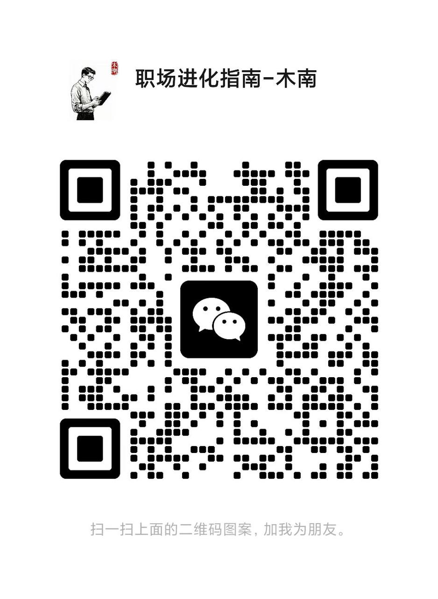

# 第5章：30天内最少一次学习分享

## 一、为什么要做分享？

> **对团队：低成本、高精准的员工能力评估窗口**
>
> leader通过你的分享内容、逻辑与细节，能快速判断你 “是否能跟上业务节奏”“是否能独立创造价值”，这两大判断直接影响你的任务分配、成长资源与转正评价。

### 团队目的1：看你的业务学习能力怎么样

> 业务学习能力 ≠ 学了多少知识，而是能否精准捕捉业务核心、能否将外部知识转化为岗位价值、能否从实践中提炼规律。
>
> 判断依据有3点
>
> **1、学习内容是不是围绕 “业务痛点”&#x20;**
>
> **2、学习过程有没有 “批判性学习” 意识（不要全盘相信，要带自己的思考和判断）**
>
> **3、学完以后能不讲清 “业务流转路径”**

### 团队目的2：看你上手后的工作能力怎么样

> 招人的目的就是干活，解决工作中的困难。
>
> 所以leader很关心新人 “**能否独立完成岗位基础任务、能否把控工作细节、能否解决实操卡点**”，从而判断你是否具备 “承担更重责任” 的资格
>
> 会重点查看下面3点：
>
> **1、能讲清工作全流程细节，而非只说结果（做了什么）**
>
> **2、能聚焦可落地的细节优化，而不是空喊口号**
>
> **3、能独立解决业务实操卡点，不用强依赖别人**

> **对个人：像leader展示你的学习进度、证明岗位适配性、获取成长指导**
>
> **成长一体三面法**
>
> 练兵场：打磨能力，为成长打基础
>
> 纠错纠偏：补全短板，让成长更精准
>
> 展示强项：放大价值，让成长被看见

### **个人目的1、日常学习分享就是转正答辩的练兵场！**

> 转正答辩的本质是**证明你适配岗位、具备成长潜力**，这需要你具备**逻辑清晰的表达、成果可视化的呈现、应对提问的从容**三大能力。
>
> 而日常分享正是低风险、高频次的实战训练，能提前打磨这些核心能力，避免转正时因临场紧张、表达混错失机会。

### **个人目的2、让leader、同事帮你纠错纠偏（识别能帮助你的人）**

> 自我认知往往有盲区！ 你觉得逻辑通顺的方案可能存在目标偏离，你认为无懈可击的流程可能藏着实操漏洞。
>
> 分享的过程就是主动暴露思考盲区的过程，既能**借助他人经验补全短板**，更能通过**谁愿意给你精准建议**识别出职场贵人
>
> **【说点隐晦的】**
>
> 主动分享让别人纠错，本质是表示自己的心态很开放，愿意接受别人的指导和建议。
>
> 那些愿意帮你纠偏的人（如愿意点拨你的leader、乐于分享经验的同事），往往是未来能给你资源、带你做项目的关键人脉；而你的虚心接受建议，也会让leader、同事觉得你 “可塑、靠谱”，进一步强化信任。

### **个人目的3、亮剑时刻，把你的工作强项展示给大家**

> **核心：做了什么，不如让别人知道你擅长什么！**
>
> 而日常分享就是低成本展示强项的窗口！
>
> 通过展示你的工作强项（如数据分析、文案撰写、流程梳理），让leader、同事形成 “提到 XX 事，就想到你” 的认知，建立个人职场标签，进而建立不可替代性。
>
> **【注意点】**
>
> 不是炫耀而是分享！一定要虚心，千万别有傲气！

## 二、分享哪些主题内容？

> **以前公司有项目红黑榜，只要有人贡献好内容，就会加分，项目完结后根据评分，额外发奖金和礼品**

### **主题1、岗位实操型：做了什么，就分享什么**

**【内容核心】**

立足当下自身经手的具体工作，分享 “实操方法、工具技巧、流程优化”，这类主题最具真实性和复用性，既能练手表达能力，又能自然展示工作强项。

**【实操案例】**

| **岗位类型** | **主题示例**                    | **核心价值点**         | **适配场景**    |
| -------- | --------------------------- | ----------------- | ----------- |
| 运营岗      | 3 次社群促活失败后，我总结的 “话题引爆” 3 步法 | 拆解失败经验 + 可复用的实操技巧 | 刚做完社群运营任务后  |
| 产品岗      | 用Axure画高保真原型：新人避坑指南（附组件库分享） | 工具实操技巧 + 团队可复用资源  | 刚掌握原型设计工具后  |
| 职能岗（行政）  | 公司会议纪要高效输出法：15 分钟搞定重点       | 流程优化技巧 + 模板分享     | 长期负责会议纪要工作后 |

**【避坑点】**

1、别选我没做完 / 没落地的主题，缺乏实操细节，容易被别人问到

2、避免大而全（如《运营全流程解析》），新人聚焦单一模块就行了。

### 主题2、问题复盘型：踩过什么坑，就分享什么

**【内容核心】**

核心是工作中遇到的真实问题 / 失误，分享「问题定位过程、尝试过的解法、最终结论」，这类主题能体现你的复盘能力，还能主动暴露思考盲区，吸引同事 / leader帮你纠偏。

**【实操案例】**

| **问题类型** | **主题示例**                     | **核心价值点**       | **适配场景**        |
| -------- | ---------------------------- | --------------- | --------------- |
| 执行失误型    | 数据报表错漏 2 次后，我搭建的3步校验法        | 失误复盘 + 防错体系搭建   | 刚因细节失误被提醒后      |
| 协作卡点型    | 跨部门对接总卡壳？我试过的需求同步 3 个关键动作    | 协作问题拆解 + 解决方案验证 | 刚完成跨部门协作任务后     |
| 认知偏差型    | 《我曾误以为用户想要的，其实是我想给》1 次需求调研反思 | 认知误区拆解 + 修正方法   | 刚做完用户调研，发现需求误判后 |

**【避坑点】**

1、别只吐槽问题，必须带 “解法尝试” 或 “反思结论”，否则变成抱怨大会

2、避免暴露原则性错误（如我漏了客户核心需求导致项目延期），优先选 “非致命、可改进” 的问题（如需求文档漏了验收标准导致返工）

### 主题3、成长进阶型：学了什么，就分享什么

**【内容核心】**

主动学习的新知识 / 新工具 / 新思维，结合岗位实际拆解 “如何落地应用”，这类主题能体现你的主动成长意识，还能为团队引入新视角，**是leader最喜欢的分享会。**

**【实操案例】**

| **学习类型**  | **主题示例**                       | **核心价值点**      | **适配场景**          |
| --------- | ------------------------------ | -------------- | ----------------- |
| 工具 / 技能学习 | 刚学的 ChatGPT技巧：3 句话写好活动文案       | 新工具应用 + 岗位落地案例 | 学完新工具并尝试应用后       |
| 行业知识学习    | 看了 10 份行业报告，总结2025 私域运营 3 个新趋势 | 行业洞察 + 团队可借鉴方向 | 主动研究行业动态后         |
| 思维方法学习    | 用MECE法则拆解项目规划目标                | 思维模型 + 工作落地步骤  | 用新思维解决 “规划漏项” 问题后 |

**【踩坑点】**

1、千万别选和岗位无关的主题，上班就是上班，别想着其他

2、不要纯理论堆砌（如MECE 法则详解），这东西上网一查都有了，必须加 “我如何用它解决工作问题” 的实操案例

## 三、怎么分享内容才能达到目的？

> 无论选择哪个主题，内容都必须紧扣听众需求！
>
> leader想看到你的思考与成长，同事想得到可复用的方法 / 工具（如果有）。
>
> 总结了一个4 段式内容结构，基本能适配大部分分享场景
>
> **工作引入 → 方法拆解 → 案例佐证 → 总结延伸**

### 1、4段式内容模版

> 形式：极简 PPT（5-8 页）+ 1 份学习笔记（用于演示案例）

| **阶段**               | **分享思路**          | **核心任务**                                       | **模板句式**                                                                            |
| -------------------- | ----------------- | ---------------------------------------------- | ----------------------------------------------------------------------------------- |
| **工作引入****（1-2 分钟）** | 为什么这个事情值得分享？      | 用具体场景唤醒听众共鸣，说明分享的必要性                           | 最近做 XX 工作时，我遇到了【具体问题】，试了【1-2 个无效方法】，后来通过【调研 / 实操 / 请教】找到了解法，今天想和大家分享，或许能帮到有同样困扰的同事。 |
| **方法拆解****（5-8 分钟）** | 核心逻辑 / 步骤 / 技巧是什么 | 用结构化语言 讲清方法，附 “细节 / 工具 / 注意事项”，确保听众能听懂、能复用     | 解决这个问题的核心是【1 个工作方法/技巧】，具体分 3 步：① 【步骤 1】…② 【步骤 2】… ③ 【步骤 3】…                         |
| **案例佐证****（3-5 分钟）** | 我是怎么用这个方法的        | 用自己的真实经历证明方法有效性，附 “数据 / 细节 / 对比”，增强可信度         | 我用这个方法做了【具体实践】，之前【旧状态】，中间踩过【小坑】，后来调整了【细节】…，最后完成了【成果】                                |
| **总结延伸****（1-2 分钟）** | 听众能带走什么 / 我还想请教什么 | 提炼核心结论，给听众 “可带走的工具 / 模板”，并主动求建议（对应分享目的 2：纠错纠偏） | 总结下来，核心就是【1-2 句话结论】，我整理了《xxxxx》（附链接），大家可以拿去用。最后，想请教下各位前辈，帮我把个关，看下哪里有问题。             |

**切记：不要把问题留在分享会上问，一定要提前问好，分享会上只是分享。**

**另外：一定要做好会议纪要，特别是leader提出的建议。**

### 2、绝对不能犯的3个错误

**1️⃣内容无干货，全是正确废话**

正确的废话听起来没错，但毫无实操价值。基本都是理论、常识、缺乏细节的结论，**本质是没有将学习 / 工作内容转化为可感知的价值信息**，leader听完只会觉得你什么也没学到，分享就是走过场。

> 案例
>
> 新人说：本周我学习了需求分析，知道要关注用户痛点，接下来会好好做社区话题功能的需求拆解。
>
> leader问：你具体用什么方法找用户痛点？目前找到哪些关键问题？
>
> 新人答：就是看用户反馈，还没具体找。​
>
> **问题核心：关注用户痛点是产品岗的基础常识（正确的废话），但未说清 “用什么方法、做了什么动作、有什么初步结论”（干货），leader无法判断你的学习落地进度。**

**2️⃣过度炫技，忽视了分享的目标**

沉迷技能 / 工具的细节展示，偏离分享核心目标！

所有岗位的技能 / 工具都是手段，分享的目的是展示你的学习、成长，不是让你展示技能多牛逼。

**3️⃣写完资料后不和mentor/leader核对**

> 这是很多新人踩过最大的坑，**分享之前不找leader，分享时暴露出很多低级错误**
>
> **不仅让参会人觉得你能力不行，可能还会连累mentor**
>
> 写完分享PPT记得提前和导师核对一下，让ta帮忙把下关，如果没有导师，让leader、关系好的同事帮忙把关

### 3、分享PPT模版

待补充（等写完了再整理，有着急的可私信博主）\~

## 四、日常工作如何积累分享素材

### 1、跟着工作流程顺手存素材

| **常规任务**         | 最基础的素材库                                        | 重点积累 “**做了什么优化、用了什么方法、带来什么变化”**                     |
| ---------------- | ---------------------------------------------- | --------------------------------------------------- |
| **处理问题 / 踩坑**    | 最高价值的分享素材，既能体现个人复盘能力，又能给同事提供 “避坑指南”。           | 积累时需避免只记出了什么错，要完整留&#x5B58;**&#x20;“解决过程与可复用教训”**    |
| **主动学习 / 技能提升**  | 体现成长意愿的重要素材新人试用期的 “主动学习”（如学工具、学理论、学前辈经验）       | 要重点积累学完怎么用、用了有什么效果（理论到实践的转化）                        |
| **捕捉灵感 / 碎片化启发** | 最优质分享素材日常工作中的 “碎片化灵感”（如用户的一句话、同事的一个技巧、行业的一个趋势） | 这一点重在立刻记录，不管是发微信还是在线文档**PS：博主的灵感特别多，很多文章的内容都是这么来的** |

### 2、素材积累工具与分类模板

| **工具类型** | **推荐工具**               | **核心优势**           | **适用场景**                   |
| -------- | ---------------------- | ------------------ | -------------------------- |
| 结构化整理    | Notion**飞书文档（博主再用飞书）** | 可建数据库、分类标签，支持多人协作  | 长期素材（任务复盘、问题解法、学习转化）       |
| 即时捕捉     | 手机便签、语音备忘录、微信文件传输助手    | 30 秒快速记录，不打断工作流    | 灵感碎片、即时问题                  |
| 可视化素材    | 截图工具、云相册               | 留存原型截图、数据图表、bug 截图 | 技术岗的代码片段、运营岗的社群截图、职能岗的流程图示 |

**有需要可扫码加好友（备注飞书），博主期待和更多同学交流。**

微信号：zhizhiqian1

# 第6章：30天内完成N+3次复盘，建立成长操作系统

## 一、为什么一定要做复盘？

> 刚毕业2-3年的职场新人，经常陷入越努力越迷茫的怪圈
>
> 1、明明学了别人的工作SOP，能力不见明显提升
>
> 2、做了很多工作，但同样的错误总是反复犯
>
> 3、同类工作总是从零开始的困境
>
> 4、一直忙着干活，回头写转正答辩找不到价值点
>
> 5、做了很多工作，但是汇报的时候说不出来

解决上面问题最好的办法，就是**坚持自我复盘**，把个人成长学习记录表，升级&#x4E3A;**【自我成长操作系统】**

操作系统就好像是AI一样，你给ta输入越多，ta就会变的越来越好用！

系统运行的核心，是大量、持续性的【**输入-内化-输出】**

具体执行拆成四个步骤：

**自我觉察 → 复盘调整 → 经验沉淀  → 持续改迭代**

> **自我觉察：**&#x54EA;些地方做的好？哪些做的不足？还有哪些忘了做？
>
> **复盘调整：**&#x4E3A;什么做的好？为什么没有做好？怎么做才能更好？怎么避免下次不出错？
>
> **经验沉淀：**&#x80FD;沉淀/优化哪些工作方法、SOP、思维模型、系统化思考逻辑？后面能拿来直接套用
>
> **持续迭代：**&#x53CD;复执行上述3个动作，直到形成本能，操作系统就会稳定运转

## 二、什么是N次复盘？

是指不同场景下、不同时间下的各种小复盘

### 1、每日快速小复盘模版

> 今天做了什么工作？
>
> 有没有完成？没完成的原因？
>
> 过程哪里做的好？为什么好？
>
> 遇到了什么问题？有没有解决？
>
> 下次做有没有更快的方法？

### 2、任务启动小复盘模版

> 任务的完成标准/时间是否清晰？
>
> 评估的时间准不准？
>
> 有没有同类任务的失败案例？
>
> 上次失败原因是什么？
>
> 改进成功措施是什么？

### 3、任务管控小复盘模版

> 任务排序时，有没有考虑到优先级？
>
> 进度有没有及时同步给导师/leader？
>
> 过程出现风险后有没有及时上报？

### 4、遇到问题小复盘模版

> 遇到卡点问题怎么处理，是请教别人还是自己努力？
>
> 请教别人前该做什么？该用什么话术？
>
> 自己努力应该怎么做？有没有可套用的工作方法？模型？
>
> 有没有过往案例可参考？

### 5、发生错误小复盘模版

> 错误发生在哪个环节？
>
> 造成错误的主观和客观原因是什么？
>
> 现在有哪些补救措施？
>
> 后面应该做哪些预防方法？

### 6、成长沉淀小复盘模版

> 这件工作干完有哪些收获？掌握新技能？
>
> 这些收获能不能转化成话术、方法、SOP、思维模型、思考逻辑？
>
> 能不能分享到团队一起用？

### 7、自我提升小复盘模版

> 把自己拔高一个层级来看待问题？比如转变为mentor、leader视角
>
> 有没有更好的思路、方案？

## 三、什么是3次复盘

**复盘关键**：每次复盘都&#x8981;**「带着问题找答案，带着答案做改进，带着改进要反馈」**

**复盘目标**：让领导看到你的**复盘意识、改变速度、成长潜力**

**复盘节奏：第 1 周适应→第 2 周实操→第 4 周进阶**

### 入职第一周：适应期复盘

**核心目标：**&#x7406;清基础，消除盲区

**复盘重点：是否清晰岗位核心职责、是否掌握基础工具、是否明确协作链路**

**复盘模版：**

| **复盘维度** | **核心内容**           | **问题与改进动作** | **向领导同步的重点**                             |
| -------- | ------------------ | ----------- | ---------------------------------------- |
| 业务与职责理解  | 1、岗位核心 KPI2、业务流程   | 问题示例： 改进动作： | 1、已理清的核心职责2、待确认的 2-3 个具体问题               |
| 基础工具掌握   | 1、已掌握工具2、未掌握工具     | 问题示例：改进动作：  | 1、已掌握的工具及应用场景（证明快速适应能力）2、工具学习计划（体现主动补短板） |
| 团队协作     | 1、人员关系2、沟通方式3、会议节奏 | 问题示例：改进动作：  | 1、已熟悉的协作规则（证明 有融入意识）2、需协助的资源             |

**复盘收获**

* 岗位核心职责 & 业务流程图（可作为学习分享/转正答辩业务理解素材）

* 工具学习计划 & 协作规则清单（后续分享新人适应技巧的素材）

**注意点：复盘以后记得先和mentor拉齐，完了有需要再找leader 1 v 1。**

### 入职第二周：实操期复盘

**核心目标：**&#x843D;地基础任务，暴露实操问题

**复盘重点：任务完成质量、遇到的实操卡点、从中学到的方法**

**复盘模版：**

| **复盘维度** | **核心内容**                | **问题与改进动作**                                                      | **向领导同步的重点****（关联信任建立）**                              |
| -------- | ----------------------- | ---------------------------------------------------------------- | ----------------------------------------------------- |
| 任务落地详情   | 1、完成的具体任务2、任务中的关键动作     | 问题示例：改进动作：1、针对知识盲区：整理任务高频问题清单2、针对方法不足：学习标准化记录模板                  | 1、任务成果（用数据说话，证明有落地能力）2、主动暴露的问题 + 改进计划（体现有复盘意识，而非隐瞒问题） |
| 协作卡点解决   | 1、跨岗位 / 同事协作的具体事项2、解决过程 | 问题示例改进动作：1、总结协作沟通公式2、每次协作后同步确认邮件 / 文档，避免理解偏差                     | 1、协作中的学习（证明能从失误中成长）2、后续协作的优化思路（体现主动优化效率）              |
| 可复用经验    | 1、从任务 / 协作中提炼的方法、SOP等   | 问题示例：改进动作：1、建立经验笔记本：每次任务后记录「1 个有效动作 + 1 个无效动作」2、每周向前辈请教1 个岗位核心技巧 | 1、提炼的可复用经验（证明 有思考能力，而非机械执行）2、需前辈指导的方向（体现 虚心好学）        |

**复盘收获**

* 任务落地数据 & 问题改进清单（学习分析/转正答辩实操能力素材）

* 协作沟通公式 & 岗位小技巧（后续分享新人实操避坑的素材）

### 入职第四周：进阶期复盘

**核心目标：**&#x603B;结成长成果，明确进阶方向

**复盘重点：成长对比（第 1 周 vs 第 4 周）、核心任务贡献、待突破的能力短板**

**复盘模版：**

| **复盘维度** | **核心内容（含跨岗位示例）**                | **问题与进阶计划**                    | **向领导同步的重点****（关联转正准备）**                          |
| -------- | ------------------------------- | ------------------------------ | ------------------------------------------------- |
| 成长成果对比   | 1、能力成长（第 1 周 vs 第 4 周）2、贡献的核心价值 | 问题示例：进阶计划：1、短期（1 个月内）2、长期（转正后） | 1、核心成长成果（用对比数据证明适配岗位）2、进阶计划（体现有长期成长意识，值得培养）       |
| 核心任务参与   | 1、参与的核心任务及角色2、任务中的关键贡献          | 问题示例：改进动作：1、针对沟通短板2、针对优先级      | 1、核心任务中的贡献（证明 能为团队创造价值，不止是执行）2、改进动作（体现能发现短板，主动优化） |
| 职场信任积累   | 1、获得的认可（领导 / 同事）2、需加强的信任点       | 改进动作：1、针对信任短板2、持续做信任加分项        | 1、获得的认可（侧面证明融入团队，能力被认可）2、主动申请信任测试机会（体现有担当，想承担更多）  |

**复盘收获**

* 4 周成长对比报告（转正答辩核心素材，含数据 + 成果 + 认可）

* 进阶计划 & 信任提升动作清单（后续职业成长的行动指南）

### **总结：3 次复盘是从完成任务到证明价值**

* 第 1 周：解决会不会（基础认知），为后续实操打地基

* 第 2 周：解决做得怎么样（实操能力），从单纯执行变为有思考的执行

* 第 4 周：解决能创造什么价值（成长潜力），为转正和长期发展证明你值得培养

## 四、进阶版：把复盘融入成长操作系统

如果你能完成上述复盘，你就可以把他们组合为**系统成长引擎**

**【目标校准→ 执行落地 →反馈收集 → 复盘迭代 → 成果沉淀】**

| **系统模块** | **核心任务**                       | **复盘的引擎作用**                                  |
| -------- | ------------------------------ | -------------------------------------------- |
| **目标校准** | 设定当前工作核心目标（分阶段目标 + 能力目标）       | ① 复盘目标与实际业务的匹配度② 跟进目标进度，及时调整资源投入             |
| **执行落地** | 执行日常任务（基础任务 + 核心任务）            | ① 复盘任务执行中的阻塞点② 验证方法有效性，优化执行效率                |
| **反馈收集** | 完成后收集领导 / 同事反馈（正面 + 负面）        | ① 复盘反馈背后的核心问题，避免只听表面② 跟进反馈落地进度，确保改有结果        |
| **复盘迭代** | 定期复盘（日 / 周 / 月，对应 3 次关键复盘）     | ① 整合前 3 模块信息，形成成长全景图② 提炼可复用经验，转化为分享素材 / 能力沉淀 |
| **成果沉淀** | 积累可证明成长的素材（任务成果 + 分享内容 + 信任证据） | ① 复盘成果的价值密度，聚焦高价值素材② 挖掘成果与目标的关联，强化目标达成证明     |

**有需要可扫码加好友（备注飞书），博主期待和更多同学交流。**

微信号：zhizhiqian1

**需要可扫码加好友（备注订单号），博主期待和更多同学交流。**

# 第7章：90天内最少完成 7 次  1 v 1

> **什么是1 v 1 ？**
>
> 指一对一沟通，是领导与员工之间定期进行的、一对一、结构化的双向沟通。其目的不仅是汇报工作进展，更重要的是建立信任关系、提供反馈与支持、识别情绪与动力，并共同推进成长与调整。

**对于职场新人来说：1 v 1 沟通是新人与leader / mentor对齐方向、解决卡点的核心场景！**

有些公司是规定1 v 1，就不用操心，但有些公司没有，就得自己上心。

## 1 v 1 沟通整体节奏

| **阶段**   | **时间节点** | **沟通对象** | **核心目标**           | **核心价值**            |
| -------- | -------- | -------- | ------------------ | ------------------- |
| 第一阶段入职适应 | 1、2 天内   | leader   | 校准岗位认知，明确基础规则      | 避免认知偏差，快速融入团队       |
|          | 2、第 15 天 | mentor   | 解决初期执行卡点，优化工作方法    | 避免任务堆积，确保基础任务落地     |
|          | 3、第 30 天 | Leader   | 复盘首月成长，对齐下月目标      | 证明首月价值，明确后续成长方向     |
| 第二阶段实操深化 | 4、第 45 天 | mentor   | 突破核心任务瓶颈，提炼复用经验    | 从会做事到做好事，积累专业能力     |
|          | 5、第 60 天 | Leader   | 同步成长成果，申请进阶任务      | 争取更多资源，向核心业务靠拢      |
| 第三阶段进阶成长 | 6、第 75 天 | mentor   | 解决进阶任务挑战，完善能力短板    | 补全能力短板，具备独立负责任务的基础  |
|          | 7、第 85 天 | Leader   | 复盘 90 天成长，规划长期发展路径 | 明确职业定位，为转正 / 晋升奠定基础 |

## 第1次：岗位认知拉齐

解决新人入职初期因信息不对称/不透明产生不知道做什么、该怎么做的困惑，通过和leader沟通后，明&#x786E;**「岗位核心职责、协作规则、资源支持」。**

**沟通对象：**&#x6C;eader

**沟通内容：**

| **沟通环节** | **核心议题**                                      | **新人准备清单**                     | **需要拿到的资源**                |
| -------- | --------------------------------------------- | ------------------------------ | -------------------------- |
| 岗位认知     | 1、岗位主要负责什么工作？2、核心 KPI 是什么？3、试用期 30 天的关键任务有哪些？ | 1、提前阅读岗位 JD，列出 2-3 个对职责的疑问     | ① 明确 KPI 的统计口径② 提供试用期任务清单  |
| 协作规则     | 1、日常沟通的优先级怎么分？（哪些事问领导，那些事问导师）2、哪些会议必须参加？      | 无                              | ① 分享团队协作文档② 明确各个会议明细、时间、流程 |
| 资源支持     | 1、遇到问题该找谁？2、有哪些学习资料可以用？                       | 1、整理求助清单模版（含对接人、擅长领域）2、提出需要的资源 | ① 拉群对接关键支持人② 发送学习资料包（如有）   |

**后续动作：24 小时内整理好沟通纪要，同步给leader确认理解无误。**

## 第2次：任务执行沟通

入职半个月后，新人已接手基础任务，最容易出现 “**业务不熟悉导致工作效率低**” 的问题，需要通过和mentor及时沟通解决。

**沟通对象：**&#x6D;entor

**沟通内容：**

| **沟通环节** | **核心议题**                         | **新人准备清单**                                           | **过程记录要点**                       |
| -------- | -------------------------------- | ---------------------------------------------------- | -------------------------------- |
| 任务进度复盘   | 1、前 15 天完成了哪些任务？2、目标完成度如何（数据对比）？ | 1、带任务执行复盘日志2、准备数据对比表（目标 vs 实际）3、总结2 个做得好的点 + 1 个待改进点 | 1、肯定做得好的细节，询问具体原因2、分析未达标原因，记录为什么 |
| 卡点原因分析   | 1、目前最棘手的 1 个卡点是什么？2、已尝试过哪些解法？    | 1、用场景化描述讲卡点2、列出已尝试的 3 种方法 + 效果3、提出1 个猜想的解法           | 1、分析卡点本质原因2、提供针对性方法              |
| 方法优化     | 1、接下来 15 天怎么调整工作方法？2、需要哪些支持？     | 1、制定15 天优化计划（含每日核心动作）2、列出需要的资源清单（如数据、文档）             | 1、确认优化计划的可行性                     |

## 第3次：首月复盘与目标会

首月结束后，一定要做系统复盘，聚焦「成长成果、存在问题，对齐下月目标」，让领导看到你的成长潜力。

**沟通对象：**&#x6C;eader

**沟通内容：**

| **沟通环节** | **核心议题**                              | **新人准备清单**                                              | **期望达成目标**                |
| -------- | ------------------------------------- | ------------------------------------------------------- | ------------------------- |
| 首月成长复盘   | 1、首月完成了哪些核心任务？2、能力上有哪些提升？3、有什么可复用的经验？ | 1、带《首月成长总结/复盘》（含数据成果、经验总结）2、准备2 个典型案例3、整理可复用的模板 / 清单/方法 | 1、肯定核心成果2、点评经验的价值3、指出隐性成长 |
| 问题与改进    | 1、首月最大的不足是什么？2、接下来怎么改进？               | 1、坦诚2 个核心不足2、提出具体改进计划                                   | 1、分析不足的本质2、提供改进资源         |
| 下月目标对齐   | 1、下月想承担哪些更有挑战的任务？1、需要哪些资源支持？          | 1、提出下月目标清单2、说明目标的价值                                     | 1、确认目标的合理性                |

## 第4次：核心任务瓶颈突破

第 2 个月新人已接触进阶任务，很容易遇到能力瓶颈，需通过此次沟通拆解瓶颈、学习专业方法，积累独立负责任务的基础。

**沟通对象：**&#x6D;entor

**沟通内容：**

| **沟通环节**  | **核心议题（通用）**                        | **新人准备清单**                                                                       | **期望达成目标**                                      |
| --------- | ----------------------------------- | -------------------------------------------------------------------------------- | ----------------------------------------------- |
| 进阶任务进度    | 1、目前负责的核心任务进展如何？2、已完成的关键动作有哪些？      | 1、带《进阶任务进度表》（含时间节点、完成比例、关键动作）2、准备任务卡点记录（标注每个卡点出现的场景、尝试的动作）3、总结1 个阶段性成果 + 1 个核心卡点 | 1、肯定阶段性成果2、梳理卡点与任务进度的关联3、明确本次沟通的核心目标：突破 1 个关键瓶颈 |
| 核心瓶颈拆解与方法 | 1、瓶颈的本质是什么？2、有哪些专业方法能解决？            | 1、提前梳理瓶颈分析表（含瓶颈表现、猜想原因、需要的方法支持）2、准备空白笔记本，记录导师演示的关键步骤                             | 1、拆解出瓶颈本质原因2、提供针对性方法工具3、现场演示关键步骤4、纠正认知偏差        |
| 突破计划与资源支持 | 1、接下来 15 天如何推进瓶颈突破？2、需要哪些具体资源 / 支持？ | 1、制定15 天瓶颈突破计&#x5212;**（非必须项，但如果融入效果差，必做）**&#x32;、列出资源需求清单3、确认反馈节点               | 1、审核突破计划的可行性2、协调所需资源3、明确反馈机制                    |

## 第5次：成果同步与资源争取

第 2 个月结束后，一定要及时给leader同步任务成果，证明能胜任当前工作，同时主动争取核心资源，向核心业务靠拢（**博主当时试用期第三个就申请当PL，转正后第一年就做leader**）。

**沟通对象：**&#x6C;eader

**沟通内容：**

| **沟通环节**                               | **核心议题（通用）**                                   | **新人准备清单**                                                               | **期待达成目标**                                       |
| -------------------------------------- | ---------------------------------------------- | ------------------------------------------------------------------------ | ------------------------------------------------ |
| 成果同步                                   | 1、第 2 个月完成的核心任务有哪些？2、成果数据与目标对比如何？3、形成了哪些可复用经验？ | 1 带成果清单（含任务列表、数据对比表、经验总结）2、准备可复用经验的实物载体（如模板、清单、案例截图）3、提炼2 个核心成果 + 1 个价值点 | 1、肯定核心成果与价值2、点评经验的复用性3、记录成果亮点（用于后续团队分享或转正评估）     |
| 资源争取与任务申&#x8BF7;**（想往上爬就关注这一条，不想就忽略）** | 1、接下来想承担哪些更核心的任务？2、申请这些任务的优势是什么？3、需要哪些资源支持？    | 1、准备任务申请理由（含任务名称、申请理由、自身优势、预期目标）2、说明任务与个人能力的关联3、明确资源需求的具体用途              | 1、评估任务申请的合理性2、确认资源支持范&#x56F4;**（比如：相当PL，就得有名分）** |
| 问题复盘与改进                                | 1、第 2 个月存在的不足是什么？2、后续如何改进？                     | 1、坦诚2个不足点2、提出改进计划（含学习路径、时间节点、需要的支持）3 、询问改进方向的正确性                         | 1、分析不足的本质原因2、提供改进资源3、设定改进验收标准                    |

## 第6次：能力短板讨论会

这次沟通非常关键，是你能不能顺利转正的评判点。有两个案例

> **案例1：我之前带过一位姑娘**
>
> 她有一个很明显的短板：当众讲话时，只要人一多，她就容易紧张，说话就哆嗦。
>
> 但她的岗位是产品经理，后续开各种会议人肯定会很多，如果不尽快改正，很难渡过试用期，最后和她讨论完，给她定了一个计划，在后续2周内，由她组织部门的日会、周会，锻炼这种能力，最后在转正前改善很多，顺利转正）
>
> **案例2：博主自己的故事**
>
> 毕业在第一家公司上班时，平时说话都很好，但是一旦主动给别人打电话，不知道为什么就容易结巴，真就那种说不出话的感觉，还好当时的leader人很好，给我出了很多招，比如晚上读书完了录音，可以发给她帮忙看；还组织了部门的读书会，让大家在会议室给别人读自己喜欢的书。

| **沟通环节**  | **核心议题（通用）**                                    | **新人准备清单**                                            | **期待达成目标**                            |
| --------- | ----------------------------------------------- | ----------------------------------------------------- | ------------------------------------- |
|  能力短板梳理   | 1、目前最影响工作效率的能力短板是什么？2、短板在工作中具体表现为哪些问题？          | 1、自己的短板说明：具体表现场景、影响的工作、尝试过的改进动作2、准备短板相关的工作案例          | 1 确认短板的优先级2 拆解短板的核心知识点3 明确短板与转正后的任务关联 |
| 短板突破方法与工具 | 1、突破短板需要掌握哪些核心方法？2、有哪些工具 / 模板可以使用？3、如何结合工作实践练习？ | 1、准备空白笔记本，记录方法步骤、工具使用技巧2、提出方法实践中的疑问                   | 1、详细讲解核心方法步骤2、解答实践疑问                  |
| 短板突破计划与支持 | 1、接下来 15 天如何突破？2、需要哪些支持？                        | 1、制定N天短板突破计&#x5212;**（非必须项）**&#x32;、列出 支持需求清单3、确认反馈节点 | 1、审核突破计划的可行性2、协调支持资源3、设定突破验收标准        |

## 第7次：试用期成长复盘与长期规划会

转正前最关键的1次1 v 1，聊完就能知道怎么过没过，没过会告诉你原因，过了会告诉你后续规划（转正PPT需要用到）

| **沟通环节** | **核心议题**                                                | **新人准备清单**                                   | **领导输出**                                  |
| -------- | ------------------------------------------------------- | -------------------------------------------- | ----------------------------------------- |
| 90 天成长复盘 | 1、90 天完成的核心任务 / 项目有哪些？2、能力上实现了哪些突破？3、为团队创造了什么价值？        | 1、汇总工作成果表2、准备核心成果的实物证明3、提炼3 个核心成长点 + 2 个价值贡献 | 1、系统点评 90 天工作2、量化团队价值贡献3、评价成长成长亮点（用于转正答辩） |
| 长期规划对齐   | 1、未来 3-6 个月想提升哪些核心能力？2、希望承担哪些类型的核心任务 / 项目？3、需要团队提供哪些支持？ | 1、梳理未来 6 个月成长目标2、说明规划与团队业务的关联3、询问规划的合理性      | 1、评估规划的可行性与匹配度2、确认支持资源范围3、对齐团队业务节奏        |
| 转正反馈与建议  | 1、目前的表现是否符合转正要求？2、后续需要重点关注哪些方面？3、有哪些职业发展建议？             | 1、准备转正相关的疑问2、梳理重点关注方向和发展建议3 感谢领导培养的话术之类      | 1、明确转正结果2、给出具体改进建议3、提供职业发展路径4、解答转正相关疑问    |

## 避坑指南

**以下这些坑，都来源博主带过的新人，想起来就头大。（后面有时间会补充案例）**

> **1、无准备沟通**
>
> 不提前整理数据、不明确议题，到场后想到哪说到哪，领导会觉得&#x4F60;**【不重视、无规划】**，这么两次搞下来，转正就没希望了。
>
> **正确做法：每次沟通前都提前约领导时间，并发送相关讨论内容（主题和问题），让领导有时间准备。**
>
> **2、只说问题不提解法**
>
> 全程抱怨任务难、卡点多，却不说自己尝试过什么、想怎么解决。
>
> **正确做法：说问题时必带已尝试的 2-3 种解法 + 效果，即使没解决，也要说尝试的方向，让领导看到你有思考、有行动，而不是一个只提问题的人。**
>
> **3、不跟进落地结果**
>
> 沟通时答应按方法改进，后续却没有任何动作或者反馈。
>
> **正确做法：沟通后 24 小时内同步落地计划，并找领导沟通确认，后续按1-3 天的节奏同步进展，让领导看到你的变化。**

**有需要可扫码加好友（备注飞书），博主期待和更多同学交流。**

微信号：zhizhiqian1

# 第8章：建立个人成长闭环：让能力被看见

**前面7章内容，如果你能照做下来，那接下来就是进阶环节。**

## 一、能力到底是什么？

简单说：**能力=职场专属武器**

> **什么是专属武器？**
>
> 提起吕布，第一反应是不是方天画戟+赤兔马
>
> 提起关羽，第一反应是不是青龙偃月刀
>
> 提起孙悟空，第一反应是不是金箍棒
>
> 上述案例比比皆是，因为自古宝剑配英雄
>
> **什么是职场专属武器？**
>
> 就是你在职业战场上，那个让人第一时间、强烈联想到你的核心技能、显著特质或标志性产出。它是你的专业价值名片和个人品牌烙印。
>
> 可以设想一下，提起你，大家脑海中瞬间跳出的关键词是什么？
>
> 女人：漂亮？身材好？说话好听？形象气质佳？PPT大神？EXCEL大神？
>
> 男人：帅气？口才好？表达能力强？总结能力强？千杯不醉？Axure大神？运营/产品/技术大佬？自媒体达人？
>
> **比如：提起董宇辉、罗永浩、薇娅/李佳琦，你的第一印象是什么？**

## 二、**为什么需要培养个人专属能力？**

**本质还是卷。**

有个段子讲的好：**大厂连烧火的木材都要雕花！**&#x4EC0;么意思呢，拿校招举例，招的不是应届生，而是应届实习生，而且还是实习生中的拔尖，进来不用培养就能干活的那种。

**校招都这么卷，更别说社招，所以，你得有一技傍身。**

**说说好处。**

> **建立不可替代性**
>
> 在高度分工和竞争的环境中，一个鲜明的“专属技能”是你安身立命的核心资本，让你难以被轻易取代
>
> **提升个人价值**
>
> 它会让你在领导、同事心中形成清晰、正面的高价值定位，成为特定工作求助或合作的首选
>
> > 可以回想下过往的leader和同事，有没有类似的人，就是那种某件事情必须ta才能做。
>
> **获得关键机会**
>
> 转正机会、重要项目、晋升机会、资源倾斜，往往会优先考虑在相关领域拥有“专属能力”的人
>
> > 比如你暴露出一些管理能力，如果业务能力达标，那你就会进入PL的候选池
>
> **提高议价能力**
>
> 物以稀为贵：明确的、被认可的核心价值，会在后期赋予你更强的薪酬谈判和职业发展选择权
>
> **形成正向循环**
>
> 培养专属能力的过程，就是不断精进、深化核心能力的过程，最后形成正向循环，强者恒强

## 三、为什么领导看不到你的能力？

**职场新人最容易出现的问题，不是没有能力，而是能力没有被领导、同事看到。**

**为什么会这样？**

看到的前提是你能亮出来，但问题是很多亮不出来！

> 1、大部分没有这个意识，**不知道自己的个人能力是什么**，所以根本无法传递
>
> 2、部分有意识的新人知道，但忙于埋头做事，**不懂得如何“扬长避短”**，最后导致能力没有被认可，甚至出现试用期被约谈批评能力不行的现象。
>
> 3、剩下那些略懂扬长避短的新人，问题就出在缺少方法指引，**不知道怎么“沉淀成果、传递价值”**

## **四、如何发现自己的能力？**

### 1、自我剖析三问

我的核心优势是什么？

我真正热爱且擅长做什么？

当前岗位和团队最需要什么？

### 2、结合需求定位

能力必须与你的工作相关，和你要解决的关键问题、创造的核心价值深度绑定。

跟根据岗位需求，确定1-2个最具潜力、最有价值、最能差异化的点作为“能力”候选！

> 比如
>
> 财务/运营：可以将精通EXCEL作为个人能力，但前台就不行。
>
> 产品经理：以前可以是Axure原型能力强（现在有了AI就得调整）

## 五、怎么培养个人能力？

### **建立飞轮系统：能力落地→成果沉淀→价值传递→反馈迭代**

| **飞轮环节** | **核心任务**               | **关键原则**            |
| -------- | ---------------------- | ------------------- |
| 能力落地     | 通过具体任务实践能力，解决业务问题      | **可证明**（有数据 / 动作支撑） |
| 成果沉淀     | 把能力落地过程转化为可复用成果”       | **可留存**（有实物 / 文档载体） |
| 价值传递     | 通过分享 / 沟通让能力被领导 / 同事感知 | **可传递**（贴合听众需求）     |
| 反馈迭代     | 用他人反馈优化能力，调整闭环方向       | **可优化**（有具体改进动作）    |

## 六、2 个让能力持续被看到的关键习惯

### **1、定期盘点能力成果**

每周五花 1 小时整理本周能力成长成果

> **自我提问法（放在个人成长记录表里）**

* 我这周有没有高价值的工作成果？

* 有没有一条经验可以写成自己总结的方法？

* 有没有一件事能打包进我的作品集或简历里？

每周都积累一次，就像存钱罐，多了量变就会引起质变。

转正、晋升、跳槽，你都会感谢现在这个为自己“留痕”的你。

### **2、保持适度曝光，别太频繁**

不是越多曝光越好，而是在关键节点精准曝光，避免过度炫耀引起反感

> **关键节点**

* 项目/工作复盘时

* 团队内部分享时

* 1 v 1 沟通时

你的每一次曝光都是加深别人对你的能力认知！

# 第9章：任务完成后：如何打包总结为个人资产

**总结经验、沉淀成果、转化为作品集、建立被看到的个人职业资产。**

这才是你和同龄人拉开差距的根本原因！

**这一章教你【5 步转化法】：整理个人资产 ，成为你转正、升职、跳槽时的能力证明**

## 认知：什么是可打包的个人资产

不是所有任务成果都能成为资产，需满足 3 个核心标准：

> **1、可复用性：**&#x80FD;迁移到同类任务
>
> **2、价值可证**：能体现解决的业务问题 + 数据成果
>
> **3、能力关联**：能对应个人核心能力
>
> **个人资产 =可复用成果 + 能力证明 + 业务价值**

## 步骤 1：成果筛选-挑出高价值核心成果

任务完成后，按上述资产三大标准筛选内容

**方法：问自己三个问题**

> 1、该成果能否解决未来同类任务的问题？（可复用性）
>
> 2、能否通过该成果证明某一项核心能力？（能力关联）
>
> 3、有无数据 / 案例证明其业务价值？（价值可证）

## 步骤 2：结构化整理-确保清晰易读、易复用

成果一定要按固定框架整理，让自己或他人快速理解 “**成果是什么、怎么用、有什么价值**”，

通用模版：**任务背景→核心动作→成果数据→复用指南→避坑提示**

| **分类**   | **内容**                | **说明/示例**            |
| -------- | --------------------- | -------------------- |
| **任务背景** | 说明成果对应的业务目标、核心痛点、个人角色 | 明确成果产生的场景            |
| **核心动作** | 拆解成果落地的关键逻辑、方法、步骤     | 如分层标准、优化逻辑、流程节点      |
| **成果数据** | 用量化指标体现价值             | 如新增用户量、效率提升比例、成本降低幅度 |
| **复用指南** | 明确适用场景、调整要点、依赖工具      | 教别人怎么用               |
| **避坑提示** | 标注复用或落地时的常见问题与规避方法    | 避免别人犯同样的错误           |

## 步骤 3：价值标注-给资产贴标签建关联

和收藏-建标签的场景一样，方便自己快速查找

通用标签可以分为：**能力、业务、数据、工具/模型**

| **标签类型** | **核心作用**        | **使用场景**                             |
| -------- | --------------- | ------------------------------------ |
| 个人能力     | 面试/转正/晋升时快速定位   | 面试/转正/晋升：按目标岗位能力筛选对应资产               |
| 业务成果     | 关联业务场景，用于同类任务复用 | 1、业务复用：按场景找资产2、汇报：按业务标签整理成果          |
| 亮点数据     | 蕞直观的价值呈现        | 1、转正/晋升：用数据标签量化能力价值2、分享：用数据突出成果吸引力   |
| 他人复用     | 能对外分享的部分资产      | 1、新人培训：推荐复用标签下的资产2、团队协作：标注复用资产减少重复工作 |

## 步骤 4：存储与复用 - 一定要本地化+备份

**这是最关键的一步！**

很多人上班都是用的公司电脑，而有的公司（特别是大厂）对数据保密要求极高，不允许员工私下拷贝。

如果你的资产是保存到在线文档里，一定要选择个人账户，同时定期用自己的电脑做本地化备份。

> 而且一定是平时做完就整理，千万不要等到离职前大批量搞，容易被监测出来！

## 步骤 5：迭代优化-持续输入内化输出

小红书很火的文章：一定要大量记录！

技术在进步，特别是AI时代，很多经验会被快速冲击，所以必须持续迭代！

**触发场景**

> * **新任务复用后**：发现资产适配性不足
>
> * **收到反馈后：**&#x540C;事 / 领导指出资产漏洞
>
> * **业务变化后：**&#x4E2A;人工作方向调整

## 【博主个人案例】

写这份资料其实花的时间不多，原因是博主有整理文章的习惯，比如职场新人进化系统1.0版本的24大章，内含200+文章，都是这半年持续加进去的，它就是博主做职场陪跑的的基本盘！

**有需要可扫码加好友（备注飞书），博主期待和更多同学交流。**

微信号：zhizhiqian1

# 第10章：不会汇报工作 = 工作没干好！

**这个可能是大部分职场新人都做不好的地方：会做的不如会说的！**

**你有没有过这样的经历**

> * 每周例会都很认真准备，但领导听完只说“行，继续推进吧。”
>
> * 明明已经解决了很多问题，但领导还是觉得“你还停留在执行层”。
>
> * 向上汇报时，总担心“讲不清楚、讲不到点”。

其实问题不在你做得不够，而在你说得不对。

因为汇报从来不是流水账式的展示，而是一次价值确认

**它是让leader做判断**

* 你方向对不对?

* 你有没有在解决真正的问题?

* 你值得不值得更高的信任?

## **一、先看看踩雷的汇报方式**

**1、流水账式汇报**

我周一做了A，周二做了B...

**领导内心的疑问是：所以呢？结论和结果是什么**

**2、过程诉苦式汇报**

大谈特谈过程中的艰辛、加班时长、技术难点，却弱化了最终的业务成果

**这容易让领导觉得你能力不足，只能靠苦劳博同情**

**3、无主见式请示**

领导，这个问题您看怎么办？

**将决策包袱完全甩给领导，领导认为你缺乏独立思考和解决问题能力**

**4、信息堆砌式汇报**

PPT上布满密密麻麻的文字和数据，没有一条清晰的主线

**领导觉得你说不清重点，需要自行帮你梳理逻辑，极大地增加了他的认知负荷。**

## 二、再看看优秀的汇报逻辑

**价值可见+决策推动**

你想象一下：领导每天时间宝贵，开会10分钟，ta只想知道两件事

* **你做的这件事有没有“价值”**

* **你需不需要他“拍板"或“支持”**

**所以你的汇报，本质是两件事：**

* **让价值可见：**&#x6211;不是在“做事”，而是在解决问题/创造结果

* **让领导动手：**&#x6211;来判断问题，你来拍板资源或方向。

如果你的汇报不能引导领导思考这些决策，**你只是“播报员”而不是“推动者”**

## **三、汇报3大目标**

你的汇报本质上要回答几件事情

### **1、展示功劳：我做的事，为什么重要?**

> 在组织视角里，**“完成任务”并不等于“创造价值”**
>
> 你需要通过汇报让别人看到
>
> * **你做的是对业务目标有意义的事**
>
> * **你解决的是对用户/团队关键的问题**
>
> * **你节省了时间/人力/资源，或提升了效率/数据体验**
>
> **关键动作：将你的工作与团队核心目标(如OKR)强关联，量化展示成果**

### **2、展示能力：我不只是执行，是有选择的推进**

> 领导最看重的，不是你做了多少事，而是你是否
>
> * **能识别问题本质，而不是表象**
>
> * **能提出合理路径和预案，而不是等指令**
>
> * **能独立做选择，有风险意识，能承担责任**
>
> **关键动作：通过工作过程和成果，展示出你的学习能力、深度思考能力、各项工作方法**

### **3、申请资源：我需要你支持什么/拍什么板**

> 组织里的每个人其实都忙，没人有空“听故事"
>
> 所以汇报的终极目的之一，是推动对方做动作
>
> * **给我决策支持（拍板某个方向 / 指出具体问题）**
>
> * **给我资源支持（人力、数据、排期等）**
>
> * **给我认知支持（你理解我、信任我）**
>
> **关键动作：呈现多种路径的利弊分析、风险评估及明确建议，将领导角色从“思考者”转变为“决策者”**

## **四、汇报3大技巧**

### **1、金字塔原理：永远结论先行**

> **方法：**&#x5F00;口第一句话就给出核心结论或观点。然后再用“首先、其次、最后”的结构化方式阐述支撑论据。
>
> **价值：**&#x8FCE;合了高层“时间稀缺”，让其瞬间抓住核心，愿意再听细节的特点。

### **2、利他性：从我的付出→你的收益**

> **方法：**&#x5C06;汇报视角从我做了什么，转换为这对您/业务意味着什么
>
> **价值：**&#x76F4;击领导最关心的利益点(业务增长、风险规避、效率提升),让其感到你的汇报与他息息相关，且价值密度高。

### **3、数据叙事：通过数据和案例增强感知**

> **方法：**&#x4E0D;仅罗列数据，更要解释数据的业务含义。
>
> **例如：**&#x7528;户留存率提升5%是数据；这意味着我们每月能多留住XX万核心用户,直接贡献XX万元收入则是故事。

## **五、汇报案例**

### **1、周会简报**

> 本周目标是推动车主注册页提效，我们上线了新文案和引导流程，注册转化率从4.1%提升到5.3%。
>
> 不过发现夜间转化效果差，可能跟车主阅读习惯有关，计划做时段分流测试。
>
> 需要技术本周五前配合上线AB配置。
>
> **分析：有目标、有数据、有问题、有诉求，领导听完就知道你在解决什么、有无判断力。**

### **2、项目阶段性复盘**

> 这个项目我们主要目标是拉动新用户下单率，最终实现首单率提升22%。
>
> 过程中发现文案点击高但跳出多，于是快速迭代了页面结构，避免了路径中断。
>
> 目前还存在用户画像不足的问题，计划补一轮调研并接入用户标签。
>
> 需要数据同学配合做分群分析。”
>
> **亮点：不仅讲了“做了什么”，还讲了“为什么这么做”“做了有用吗”，体现产品思考力。**

### **3、项目立项会**

> 我们建议做这个项目，是因为新人用户的下单转化率明显低于活跃用户，假设存在认知壁垒和信任门槛。
>
> 初步方案包括三个策略，预计带来5-8%的转化提升。
>
> 需要的资源包括运营支持和算法配合，希望这周能拍板方向。
>
> **亮点：讲清楚动因、目标、方案、资源，一次高质量的“领导拍板”型汇报。**

# 第11章：试用期90天 landing 重点动作

**前10章讲了很多干货，但都是相对独立，这一章就是把上面的内容串起来，让你有一个可落地执行的指引！**

## 第1-7天：建立基本盘，先让自己稳住

### **1、必须要有的几个文件库**

**就好像玩游戏一样，开局你得有自己的基地。**

**然后你才能完善它、升级它，基地越强，你就越强！**

| **文件名称**         | **文件价值和内容**                                                                     |
| ---------------- | ------------------------------------------------------------------------------- |
| **个人信息管理系统（总表）** | 把账号信息、工作资料、项目资料、团队公共资料、个人资料都管理起来                                                |
| **业务名词表（行业级）**   | 目的是让你快速熟悉行业、公司的基础知识，这样在后面几周能快速融入日常业务讨论会                                         |
| **个人学习成长记录表**    | 此表非常关键，是你能顺利融入团队、甚至提前转正的关键资料！（内含6张表：新人融入计划表、学习记录、问题记录、沟通记录、分享记录、复盘记录）           |
| **个人任务管理看板**     | 我讲了很多遍，任务管理是新人的头等大事                                                             |
| **建立团队人员关系表**    | 摸清团队里面的人事关系图，这里面猫腻比较多，做这个算是社会化的一部分。                                             |
| **日报/周报记录表**     | 一般公司都会要求员工写日报、周报，其中日报多是办公软件自带功能、周报多是邮件。入职第一周得摸清楚这个要求，然后不管是哪种形式，给自己建立一个日报/周报记录表。 |
| **个人岗位手册**       | 职场中 80% 的问题都是重复性的所以一定要让经验变成可复用的方法/模型                                            |

### **2、主动链接leader、mentor**

* **和leader的1 v 1**

上班第一天就主动发起，拉齐领导对你的定位、认知、后续工作重点及要求（不求快，先对齐）

* **和mentor的互动**

现在好导师真的不多了，这个互动的目的是让你清楚，你和mentor的工作关系：是组长/组员？是同岗位平级？还是不同岗业务合作？

不同的关系决定你们的相处方式。但不管怎么相处，请记住，凡事一定要主动！别期待mentor会主动教你知识，非常困难。

### 3、每天都要做的3件事

**很多新人上班一周了，领导和导师都不知道她干了啥！**

原因就是不主动汇报！下面这3件事，建议试用期每天都做！

* **学习业务后必须留痕**

> 不要记录到脑子里，一定要做有形记录，比如记录在纸上、文档里
>
> 记录完一定要思考，输出自己的理解、问题、想法
>
> 思考完要和mentor沟通，让她答疑，目的是知道你在学习
>
> （如果你想更快融入，每天发学习邮件，抄送mentor和leader）

* **每日快速小复盘模版**

**人是在复盘中成长的，复盘越多，成长越快**

每天下班前都问自己几个问题（一定要记录下来）

> 今天做了什么工作？
>
> 有没有完成？没完成的原因？
>
> 过程哪里做的好？为什么好？
>
> 遇到了什么问题？有没有解决？
>
> 下次做有没有更快的方法？

* **做任务管理，发日报！**

> 哪怕部门没有要求，你也要做！
>
> 因为这是前期你和leader的唯一对话窗口，**你必须让leader知道你在状态、能做事**

日报结构如下：完整学习见第2章

| **今日核心工作****（动作 + 细节 + 结果）** | 执行类：做了什么任务 + 完成进度 / 结果辅助类：配合谁做了什么 + 产出物”（体现协作性）                       |
| ---------------------------- | --------------------------------------------------------------------- |
| **个人学习****（模块+成果）**          | 学习类：学了什么内容 + 掌握程度（附链接）                                                |
| **遇到的问题与解决****（或待协调）**       | 有解决方案：问题 + 自试方法 + 最终方案（体现独立解决能力）无解决方案：问题 + 已尝试的方向 + 需要的支持（体现主动思考，不甩锅） |
| **明日计划目标****（内容+目标）**        | 聚焦 1-2 个核心重点（别列 5 条以上，显得无优先级）关联学习 / 执行，比如完成 XX 流程的实操练习，同步向mentor核对结果。 |

### 4、当周最后一天必做2件事

* **适应期自我复盘**

> 第一周完了必须做复盘，没有复盘你的周报内容会很空，无价值可写！
>
> **目标：是否清晰岗位核心职责、是否掌握基础工具、是否明确协作链路**

复盘模版如下：完整学习见第6章

| **复盘维度** | **核心内容**           | **问题与改进动作** | **向领导同步的重点**                             |
| -------- | ------------------ | ----------- | ---------------------------------------- |
| 业务与职责理解  | 1、岗位核心 KPI2、业务流程   | 问题示例： 改进动作： | 1、已理清的核心职责2、待确认的 2-3 个具体问题               |
| 基础工具掌握   | 1、已掌握工具2、未掌握工具     | 问题示例：改进动作：  | 1、已掌握的工具及应用场景（证明快速适应能力）2、工具学习计划（体现主动补短板） |
| 团队协作     | 1、人员关系2、沟通方式3、会议节奏 | 问题示例：改进动作：  | 1、已熟悉的协作规则（证明有融入意识）2、需协助的资源              |

* **基于日报写周报**

一定要写好周报！比日报重要一百倍！

**因为这是同堂竞技的机会，你写的差，别人一眼就能看出来，然后就会觉得你能力不行。**

周报结构如下：完整学习见第2章

| **本周核心工作****（目标 - 动作 - 结果）**    | 先明确本周目标再写具体动作和量化结果若有未完成的，说明原因 + 补做计划                         |
| ------------------------------- | ------------------------------------------------------------ |
| **&#x20;学习与认知沉淀****（试用期核心加分项）** | 业务认知：对公司业务 / 岗位价值的新理解技能沉淀：掌握的新技能 + 应用场景经验总结：做得好 / 不好的地方 + 原因 |
| **待解决的问题与需求****（真实+具体）**        | 问题要聚焦成长卡点需求要可落地，而非想要更多资源                                     |
| **下周工作规划**                      | 分核心任务、学习目标、协作事项3 类，每类 1-2 项（避免贪多）明确交付标准明确需要谁支持/协同            |

## 第8-30天：融入团队，建立信任感

### 1、培养任务管理SOP

**重要的事反复说，任务管理非常关键，先说带来的好处！**

> 1、用来写周报（不用在周五疯狂翻聊天记录）
>
> 2、接新任务时候的自查（有没有时间干，涉及任务接收sop）
>
> 3、每天早上更新，增加、完成、修改；写进度
>
> 4、过程review，看动作和方向跑偏没（涉及前期挖掘任务目标和交付标准）
>
> 5、deadline+风险预警，及时向上报风险或求资源
>
> 6、不仅管理自己的任务，也要管理协助自己干活人的任务(看别人的deadline)
>
> 7、给领导汇报工作（含1V1）时，能快速呈现当前工作内容和进展（加分项）

再说怎么做？

**任务启动SOP：接收→复述目标→确认输出标准→列依赖→给出排期→得到确认**

> **过程核心点**
>
> 1、**明确任务优先级**（四象限法则）：为了不耽误关键事
>
> 2、**理解任务达成标准**（时间、交付要求、区别理解认知一致）：为了少做无用功/返工
>
> 3、**动手分解执行动作**（确保这事自己能不能做）：为了确保能落地
>
> 4、**识别提出资源诉求**（发现不能做的找资源）：为了有条件把事做好
>
> 5、**提前预判潜在风险**（提前发现风险就尽早沟通）：为了有备无患

**过程同步SOP：过程产物截图或发文件 → 确认三要点：哪里对了/哪里偏了/需要什么**

> **过程核心点：**
>
> **小事情：**&#x5E72;完了，马上向leader反馈
>
> **大事情：**&#x505A;的过程中，每完成一阶段就主动汇报一次，哪怕只是个初步框架
>
> 话术：当前工作进展是xxx，中间遇到了xxx问题，我出了2个方案，建议选择A方案，原因是xxx

**过程跟踪SOP：任务目标→自己有无异常→别人有无异常→得到确认**

> **跟踪关键点**
>
> **任务目标：**&#x91CD;点看deadline+完成标准
>
> **别人有无异常：**&#x81EA;己的活好管，需要别人协助的活不好管，所以一定要跟紧！

**过程求助SOP：发现风险→尝试两种方案→对比优劣→明确需要的支持→在群内或1v1升级**

> **风险上报四步法**
>
> 上报不是「喊救命」，得有章法
>
> 第一步：先抓核心，用1句话说清风险
>
> 第二步：补细节，说清你已做的和还差的
>
> 第三步：提方案，给至少1个可行的求助方向
>
> 第四步：盯跟进，主动同步进展和新情况
>
> 话术：leader，我们遇到了一个挑战\[简述]。我分析了两个解决方案：A方案...B方案...我倾向于A因为...您觉得如何

**结果交付SOP：经验复盘→请示结果→汇报结果→汇报复盘**

> **核心点：**
>
> **经验复盘**：工作有哪些收获和成长？沉淀了什么！
>
> **请示结果：**&#x627E;leader/mentor，带修改点 + 待定点 + 请拍板
>
> **汇报结果：**&#x8FB9;讲方案 + 边讲leader/mentor的指导和决策
>
> **汇报复盘：**&#x8FC7;程讲的怎么样，领导的夸奖和批评分别是什么？原因是什么？下次应该怎么做？

### **2、锻炼个人复盘能力**

**把习惯变成下意识行为，你就出师了。**

| **复盘模版**      | **复盘内容**                                                                     |
| ------------- | ---------------------------------------------------------------------------- |
| **任务启动小复盘模版** | 任务的完成标准/时间是否清晰？评估的时间准不准？有没有同类任务的失败案例？上次失败原因是什么？改进成功措施是什么？                    |
| **任务管控小复盘模版** | 任务排序时，有没有考虑到优先级？进度有没有及时同步给导师/leader？过程出现风险后有没有及时上报？                          |
| **遇到问题小复盘模版** | 遇到卡点问题怎么处理，是请教别人还是自己努力？请教别人前该做什么？该用什么话术？自己努力应该怎么做？有没有可套用的工作方法？模型？有没有过往案例可参考？ |
| **发生错误小复盘模版** | 错误发生在哪个环节？造成错误的主观和客观原因是什么？现在有哪些补救措施？后面应该做哪些预防方法？                             |
| **成长沉淀小复盘模版** | 这件工作干完有哪些收获？掌握新技能？这些收获能不能转化成话术、方法、SOP、思维模型、思考逻辑？能不能分享到团队一起用？                 |
| **自我提升小复盘模版** | 把自己拔高一个层级来看待问题？比如转变为mentor、leader视角有没有更好的思路、方案？                              |

### 3、完成1次学习分享

**亮剑时刻！详细内容见第五章**

分享越早越好，因为**行动快结果快改正快！**

越早完成，就能越早看到差距，留给你的改正时间就越多！

**建议：**&#x5728;第二周的周四/五就完成

**注意事项：**

* 提前找mentor确认新人分享要求（材料格式、主题等）

* 有机会就看看别人的分享内容，帮助会很大

* 在下班时间（晚上）写分享材料，不要占用白天时间

* 写完材料一定要让mentor帮忙审核，排查明显错误点

* 提前咨询大家这周四/周五什么时间有空，提前建好日程（重点关心leader时间）

* 提前到达会议室，准备好演示材料，然后在群里通知大家

* 分享时做好录音（偷摸行为），完了自己听一遍做复盘，为下次做准备

### 4、完成2次正式复盘

详细内容见第6章

* **实操期复盘**

**复盘时间：一定要在学习分享前面，这样才有可分享的东西！**

**复盘重点：任务完成质量、遇到的实操卡点、从中学到的方法**

**复盘模版：**

| **复盘维度** | **核心内容**                | **问题与改进动作**                                                      | **向领导同步的重点****（关联信任建立）**                              |
| -------- | ----------------------- | ---------------------------------------------------------------- | ----------------------------------------------------- |
| 任务落地详情   | 1、完成的具体任务2、任务中的关键动作     | 问题示例：改进动作：1、针对知识盲区：整理任务高频问题清单2、针对方法不足：学习标准化记录模板                  | 1、任务成果（用数据说话，证明有落地能力）2、主动暴露的问题 + 改进计划（体现有复盘意识，而非隐瞒问题） |
| 协作卡点解决   | 1、跨岗位 / 同事协作的具体事项2、解决过程 | 问题示例改进动作：1、总结协作沟通公式2、每次协作后同步确认邮件 / 文档，避免理解偏差                     | 1、协作中的学习（证明能从失误中成长）2、后续协作的优化思路（体现主动优化效率）              |
| 可复用经验    | 1、从任务 / 协作中提炼的方法、SOP等   | 问题示例：改进动作：1、建立经验笔记本：每次任务后记录「1 个有效动作 + 1 个无效动作」2、每周向前辈请教1 个岗位核心技巧 | 1、提炼的可复用经验（证明 有思考能力，而非机械执行）2、需前辈指导的方向（体现 虚心好学）        |

* **进阶期复盘**

**复盘时间：第四周（和leader 1v 1之前）**

**复盘重点：成长对比（第 1 周 vs 第 4 周）、核心任务贡献、待突破的能力短板**

**复盘模版：**

| **复盘维度** | **核心内容（含跨岗位示例）**                | **问题与进阶计划**                    | **向领导同步的重点****（关联转正准备）**                          |
| -------- | ------------------------------- | ------------------------------ | ------------------------------------------------- |
| 成长成果对比   | 1、能力成长（第 1 周 vs 第 4 周）2、贡献的核心价值 | 问题示例：进阶计划：1、短期（1 个月内）2、长期（转正后） | 1、核心成长成果（用对比数据证明适配岗位）2、进阶计划（体现有长期成长意识，值得培养）       |
| 核心任务参与   | 1、参与的核心任务及角色2、任务中的关键贡献          | 问题示例：改进动作：1、针对沟通短板2、针对优先级      | 1、核心任务中的贡献（证明 能为团队创造价值，不止是执行）2、改进动作（体现能发现短板，主动优化） |
| 职场信任积累   | 1、获得的认可（领导 / 同事）2、需加强的信任点       | 改进动作：1、针对信任短板2、持续做信任加分项        | 1、获得的认可（侧面证明融入团队，能力被认可）2、主动申请信任测试机会（体现有担当，想承担更多）  |

### 5、完成个人工作成果归档

**重点来了：**

**第一个月建立的基本盘表格，是你和leader沟通的重要成果展示！**

**所以过程中一定要及时维护更新，确保里面有数据！**

**重点是第9章个人资产这部分，务必重视（后续会往里面添加各种实操案例）**

### 6、完成2次1 v 1

* **第1次和mentor**

**时间：**&#x7B2C;二周学习分享前

**沟通内容：顺带加上学习分享资料**

| **沟通环节** | **核心议题**                         | **新人准备清单**                                           | **过程记录要点**                       |
| -------- | -------------------------------- | ---------------------------------------------------- | -------------------------------- |
| 任务进度复盘   | 1、前 15 天完成了哪些任务？2、目标完成度如何（数据对比）？ | 1、带任务执行复盘日志2、准备数据对比表（目标 vs 实际）3、总结2 个做得好的点 + 1 个待改进点 | 1、肯定做得好的细节，询问具体原因2、分析未达标原因，记录为什么 |
| 卡点原因分析   | 1、目前最棘手的 1 个卡点是什么？2、已尝试过哪些解法？    | 1、用场景化描述讲卡点2、列出已尝试的 3 种方法 + 效果3、提出1 个猜想的解法           | 1、分析卡点本质原因2、提供针对性方法              |
| 方法优化     | 1、接下来 15 天怎么调整工作方法？2、需要哪些支持？     | 1、制定15 天优化计划（含每日核心动作）2、列出需要的资源清单（如数据、文档）             | 1、确认优化计划的可行性                     |

* **第2次和leader**

**时间：**&#x7B2C;四周选个时间（**在个人工作成果归档后**）

**沟通内容：**&#x4E2A;人成长是否符合预期，那些做的好，那些做的不足。

| **沟通环节** | **核心议题**                              | **新人准备清单**                                              | **期望达成目标**                |
| -------- | ------------------------------------- | ------------------------------------------------------- | ------------------------- |
| 首月成长复盘   | 1、首月完成了哪些核心任务？2、能力上有哪些提升？3、有什么可复用的经验？ | 1、带《首月成长总结/复盘》（含数据成果、经验总结）2、准备2 个典型案例3、整理可复用的模板 / 清单/方法 | 1、肯定核心成果2、点评经验的价值3、指出隐性成长 |
| 问题与改进    | 1、首月最大的不足是什么？2、接下来怎么改进？               | 1、坦诚2 个核心不足2、提出具体改进计划                                   | 1、分析不足的本质2、提供改进资源         |
| 下月目标对齐   | 1、下月想承担哪些更有挑战的任务？1、需要哪些资源支持？          | 1、提出下月目标清单2、说明目标的价值                                     | 1、确认目标的合理性                |

## 第31–90天：产出高价值，获得正反馈

**第一个月做了很多事，养成了很多习惯，都是为了后面两个月的高价值产出！**

### 1、必须挖掘出个人最强能力

如果你已经发现了自己的最强能力，那就持续放大，让更多的人知道和认可。

如果还没法或者没有，一定你给自己培养一个！

比如最简单的**执行力（很多基层岗位就认可这个）。**

### 2、锻炼个人汇报能&#x529B;**（超级加分项）**

**见第10章，这一点内容真的太关键了**

### 3、持续复盘和1 v 1收集反馈并改正

**这一点真的很关键，重点是后者，一定要拿到leader 的反馈！**

**第1次：和mentor沟通**

**沟通内容：**&#x5177;体内容见第7章

| **沟通环节**  | **核心议题（通用）**                        | **新人准备清单**                                                                       | **期望达成目标**                                      |
| --------- | ----------------------------------- | -------------------------------------------------------------------------------- | ----------------------------------------------- |
| 进阶任务进度    | 1、目前负责的核心任务进展如何？2、已完成的关键动作有哪些？      | 1、带《进阶任务进度表》（含时间节点、完成比例、关键动作）2、准备任务卡点记录（标注每个卡点出现的场景、尝试的动作）3、总结1 个阶段性成果 + 1 个核心卡点 | 1、肯定阶段性成果2、梳理卡点与任务进度的关联3、明确本次沟通的核心目标：突破 1 个关键瓶颈 |
| 核心瓶颈拆解与方法 | 1、瓶颈的本质是什么？2、有哪些专业方法能解决？            | 1、提前梳理瓶颈分析表（含瓶颈表现、猜想原因、需要的方法支持）2、准备空白笔记本，记录导师演示的关键步骤                             | 1、拆解出瓶颈本质原因2、提供针对性方法工具3、现场演示关键步骤4、纠正认知偏差        |
| 突破计划与资源支持 | 1、接下来 15 天如何推进瓶颈突破？2、需要哪些具体资源 / 支持？ | 1、制定15 天瓶颈突破计&#x5212;**（非必须项，但如果融入效果差，必做）**&#x32;、列出资源需求清单3、确认反馈节点               | 1、审核突破计划的可行性2、协调所需资源3、明确反馈机制                    |

**第2次：和leader沟通**

**沟通内容：**&#x5177;体内容见第7章

| **沟通环节**                               | **核心议题（通用）**                                   | **新人准备清单**                                                               | **期待达成目标**                                       |
| -------------------------------------- | ---------------------------------------------- | ------------------------------------------------------------------------ | ------------------------------------------------ |
| 成果同步                                   | 1、第 2 个月完成的核心任务有哪些？2、成果数据与目标对比如何？3、形成了哪些可复用经验？ | 1 带成果清单（含任务列表、数据对比表、经验总结）2、准备可复用经验的实物载体（如模板、清单、案例截图）3、提炼2 个核心成果 + 1 个价值点 | 1、肯定核心成果与价值2、点评经验的复用性3、记录成果亮点（用于后续团队分享或转正评估）     |
| 资源争取与任务申&#x8BF7;**（想往上爬就关注这一条，不想就忽略）** | 1、接下来想承担哪些更核心的任务？2、申请这些任务的优势是什么？3、需要哪些资源支持？    | 1、准备任务申请理由（含任务名称、申请理由、自身优势、预期目标）2、说明任务与个人能力的关联3、明确资源需求的具体用途              | 1、评估任务申请的合理性2、确认资源支持范&#x56F4;**（比如：相当PL，就得有名分）** |
| 问题复盘与改进                                | 1、第 2 个月存在的不足是什么？2、后续如何改进？                     | 1、坦诚2个不足点2、**提出改进计划（含学习路径、时间节点、需要的支持**）3 、询问改进方向的正确性                     | 1、分析不足的本质原因2、提供改进资源3、设定改进验收标准                    |

**重视改进计划表，这是影响你是否能转正的关键内容**

### 4、建立个人工作方法、SOP、模型/工具

**最快的方法就是炒别人的，比如把博主的内容都转化成自己的，然后记录到在线表格里，在1 v 1的时候拿给leader看！**

比如：

* 从自己做过的重复性任务里，总结 1-2 个 **流程文档&#x20;**。

* 例：日报模板、数据采集 SOP、会议纪要 SOP。

* 发给 mentor/团队，既能展现价值，也能提升个人专业形象。

### 5、发现问题并提出解决方案并落地（加分项）

在实践中观察现有工作流程/问题，并提出至少一项优化建议

**怎么说呢，这应该是转正PPT里面的必备项目**

这里分享一个SOP：**定义问题 - 分析问题 - 解决问题 - 实施方案 - 总结经验**

（内容太多实在是写不下了，详细版见**工作常见SOP篇**）

### 6、独立完成至少一项有明确高价值产出的任务

**抓关键词：独立完成 + 高价值任务**

**这是转正的最基本条件**

注意：独立完成不是说就必须你一个人看，你主导你汇报的也算！

前提：**按时、保质完成分配的任务，并通过验收！**

### 7、获得至少一位协作同事或外部客户的正面反馈

**转正答辩会的参会人一半都来自于上下游协作同事！**

所以，一定要搞好关系，这样哪怕是工作能力稍微差一点，起码在这里不会失去太多分！

> **如果说，你按照上述文档严格执行了，但是感觉工作做起来还是很费劲，欢迎找博主沟通，免费帮你剖析存在问题，并给出解决方案！**

**有需要可扫码加好友（备注飞书），博主期待和更多同学交流。**

微信号：zhizhiqian1

# 第12章：如何做一份加分转正PPT

带过很多新人，一说写PPT，大部分都是这么开始的

> 网上找了一个模版直接套框架
>
> 不整理思路，直接开始写
>
> PPT花里胡哨全是特效，内容成了次要信息
>
> 写完PPT，不找mentor、leader帮忙评审
>
> 讲PPT过程思路不清晰，时间掌控不到位

按照上面这种做法，可能稳过的局面会变成死局。

**这一章教你怎么写出一个逻辑清晰的加分转正PPT！**

> **哪类人需要重点查看此文章**
>
> **领导对你的试用期表现处于模棱两可的状态**
>
> **新人较多，部门内有竞争者上岗卷资源的情况**

## 一、5W1H分析法

**先分析清楚转正述职的完整背景！**

| **What**  | **汇报主题是什么？分别包括哪些内容？**                 |
| --------- | ------------------------------------- |
| **Why**   | **我为什么要做这次述职（单转正，转正+晋升？）**            |
| **Who**   | **听众都有哪些人，他们是什么角色（和我这次述职的利益相关点是什么？）** |
| **When**  | **什么时间（deadline，提前预留评审修改时间）**         |
| **Where** | **一般都是会议室（主要看显示器规格，同步调整PPT规格）**       |
| **How**   | **如何展现？PPT+演讲稿**                      |

## 二、思维导图梳理核心内容

思维导图真是好东西，先来次头脑风&#x66B4;**，完了可以找导师把关，没问题再写PPT。**

| **维度**   | **思考问题**                   | **问题分析**                                                                                 |
| -------- | -------------------------- | ---------------------------------------------------------------------------------------- |
| **价值定位** | **你的核心价值是什么？**             | 如果只能用一句话让领导记住你，你会说什么？是“快速学习并独立负责了XX模块”，还是“主动优化了XX流程，提升了团队效率”？                            |
|          | **团队的核心目标是什么？**            | 你过去90天工作，是如何与团队的OKR或KPI对齐的？你的贡献支撑了哪个目标？                                                  |
|          | **公司文化/价值观看重什么？**          | 公司是强调创新、客户第一、协同合作、奋斗？你的哪些行为体现了这些价值观？                                                     |
| **成果梳理** | **最大的3个贡献是什么？**            | 不要罗列所有工作，要筛选出最有分量、最有代表性的成果。其中哪些工作让你最有成就感？                                                |
|          | **如何用“STAR法则”包装关键成果？**     | S： 当时的情况和背景是什么？T： 你的具体任务是什么？A： 你采取了哪些关键行动？（这是重点，体现你的能力）R： 带来了什么可量化的结果？（数据、效率提升、风险规避、好评等） |
|          | **有发现问题并解决的案例吗？**          | 你是否主动发现过流程、协作或业务中的问题？是如何推动解决的？效果怎么样？                                                     |
|          | **为团队/同事带来了什么实际帮助？&#x20;** | 是分担了压力、提供了新工具，还是优化了协作流程？收集一些积极的他人反馈作为佐证。                                                 |
| **个人成长** | **最大的成长是什么？**              | 对比入职第一天，你在硬技能（工具、技术）和软技能（沟通、协作、项目管理）上有哪些飞跃？                                              |
|          | **如何学习和融入？**               | 举例说明你是如何快速学习公司业务和知识的？                                                                    |
|          | **遇到过什么挫折或挑战？是如何克服的？**     | 分享一个不致命的失败或挑战，重点突出你从中学到了什么                                                               |
|          | **不足是什么？**                 | 改进计划是什么？ 主动提出一个需要提升的方面，并配上一个具体、可行的改进计划。                                                  |
| **未来规划** | **未来3-6个月的工作计划是什么？**       | 计划要具体，并与团队目标紧密相连。                                                                        |
|          | **长期职业发展想法是什么**            | 希望在哪些领域深耕？希望未来能为团队贡献什么更大的价值？                                                             |
|          | **需要公司或领导提供什么支持**          | 可以是培训机会、项目机会或更多的指导。                                                                      |

## 三、PPT风格模版

一般大公司都有自己的PPT模版，直接套用就行，如果没有，在下方链接里找找

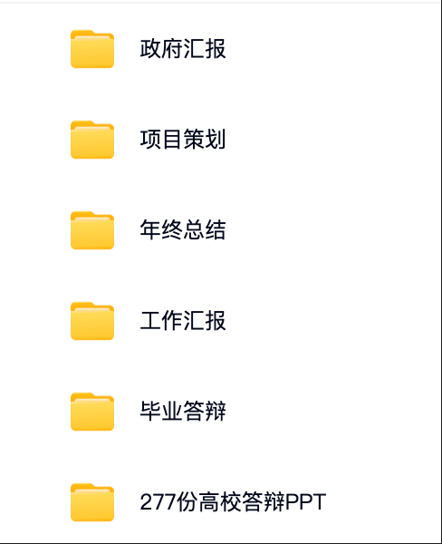

通过网盘分享的文件：PPT模版

链接: https://pan.baidu.com/s/1t2bA8MM5nQtIqPFBSa-rtw?pwd=xwd2 提取码: xwd2

## 四、PPT内容架构

| **页面**              | **内容/建议**                                                                                                                                                                                                                                                                                                               | **备注**                                                                                  |
| ------------------- | ----------------------------------------------------------------------------------------------------------------------------------------------------------------------------------------------------------------------------------------------------------------------------------------------------------------------- | --------------------------------------------------------------------------------------- |
| **P1****封面页**       | 答辩主题：XXX试用期工作总结姓名：你的姓名部门/岗位：你所在的团队和职位汇报日期：XXXX年XX月XX日                                                                                                                                                                                                                                                                   | 必须带公司Logo，色系尽量一致                                                                        |
| **P2****目录页**       | 见下文                                                                                                                                                                                                                                                                                                                     |                                                                                         |
| **P3-5****工作回顾**    | 两种方式：选择适合的**时间线结构（适合项目制工作）**&#x7B2C;1-30天：学习与融入（列出学习的工具、文档、参与的需求）第31-60天：协作与贡献（列出独立负责的小任务、支持的模块）第61-90天：独立与创新（列出主导的小项目、提出的建议）**工作模块结构（适合职能型工作）**&#x6A21;块一：日常运营工作（如：每周数据报告、内容撰写）模块二：项目支持工作（如：XX项目测试、XX活动支持）模块三：创新/优化工作（如：流程优化建议、文档整理）                                                                                   | 系统性地展示你的工作全景，体现你的条理性和工作量，重点突出从【学习到贡献】的演进过程                                              |
| **P6-7****重点成果**    | **这是PPT的核心价值点，证明你不仅做了事，还产生了价值**选择1-2个你最有成就感、最能体现你能力的成果进行深度阐述（每页1个）和上文一样，使用 STAR 法则**案例****S（情境）：**&#x56E2;队文档混乱，新人查找效率低T（任务）：需要整理核心项目文档，方便团队人员使用**A（行动）：**&#x6211;主动梳理了XX项目的所有相关文档；按功能模块重新分类，并建立了清晰的索引与老员工核对了文档的准确性，并补充了3份缺失的xxx说明。**R（结果/价值）：**&#x6700;终，建立了团队首个标准化项目文档库，据同事反馈，新同事查找文档的时间平均减少了约50%。目前该文档库已成为团队新人的必读材料。 | 一定要量化结果（提升了X%、节省了Y小时、完成了Z份报告）无法量化就说影响（获得了XX部门的好评、成为了团队标准流程）展示证据：截图、数据图表、他人表扬的聊天记录等      |
| **P8-9****发现及解决问题** | 逻辑：**问题→根因→行动→结果**方向：流程效率、工具方法、工作规范案例：较长见下文                                                                                                                                                                                                                                                                             | 态度要谦逊： 重点是“我为团队做了贡献”，而不是“我比同事聪明”案例要真实： 必须是亲自已经解决的问题，同事和领导知道价值要明确： 一定要说清楚“带来的改变”，否则就没有价值 |
| **P10****成长与复盘**    | 要写三方面1、能力提升硬技能：学会了哪些工具、什么技术？软技能：沟通协作能力、项目管理能力、解决问题能力有哪些提升？2、文化融入举例说明你如何理解和践行公司价值观。3、不足与改进计划**公式：不足 + 原因 + 改进动作 + 时间节点**诚恳地指出1-2个真实的、不致命的不足。必须附上具体的改进计划！                                                                                                                                                                 | 这部分内容非常关键，展现你的自我认知是否OK，以及个人有什么潜力。                                                       |
| **P11****未来工作规划**   | 规划必须与团队目标（OKR/KPI）对齐，让领导觉得你的成长对团队有益。近期规划（转正后3个月）：如何深化现有工作？如何弥补不足？长期规划（未来6-12个月）：希望在哪一领域成为专家？如何为团队创造更大价值？                                                                                                                                                                                                                | 表明你对未来有思考，愿意与公司共同成长。                                                                    |
| **P12****致谢**       | **简单版：**&#x8C22;谢大家**复杂版**（e人专属）：感谢公司给予的平台和机会感谢\[直属领导名]的悉心指导感谢\[导师名]的耐心帮助感谢\[团队名]所有同事的支持与包容恳请各位领导批评指正，我愿与公司共同成长！                                                                                                                                                                                                        |                                                                                         |

**P8-9发现及解决问题-案例**

**哈哈，博主在某公司开创了转正PPT必写【发现及解决问题】内容的传统！**

| **问题类别**  | **发现问题**                | **我的分析与行动**                                                                                                       | **带来的改变/价值**                                                            |
| --------- | ----------------------- | ----------------------------------------------------------------------------------------------------------------- | ----------------------------------------------------------------------- |
| **流程效率类** | 团队周会纪要分散，会后行动项不清晰，容易遗忘。 | **分析：** 缺乏统一的记录模板和跟踪机制。**行动：**&#x31;、主动创建了标准的周会纪要模板（包含：决议、行动项、责任人、DDL）2、征得leader同意后，在下次会议中试用并负责记录3、会后将行动项同步至团队看板。 | **结果：**&#x31;、会议决议落实率提升。2、行动项跟踪可视化，无人遗忘任务。3、该模板被团队采纳为固定流程。              |
| **工具知识类** | 新员工上手XX系统学习成本高，缺乏避坑指南。  | **分析：** 官方文档复杂，而实践中的小技巧散落在老员工脑中。**行动**1、在自学过程中，刻意记录了常见错误和高效技巧。2、整理成《XX系统新人上手速通指南》图文并茂的文档。3、分享给导师和领导评审，修改后同步给其他新人。 | **结果：**&#x31;、后续新同事根据我的指南，上手时间缩短约50%。2、获得了同事和导师的公开表扬。3、减少了老员工重复解答问题的时间。 |

## 五、一定要准备演讲稿

**如果你不是汇报达人，那一定要准备演讲稿！别相信自己的临场发挥能力！**

下文是一篇比较正式的演讲稿，仅供参考\~

| **页面**              | **话术**                                                                                                                                                                                                                                                                                      |
| ------------------- | ------------------------------------------------------------------------------------------------------------------------------------------------------------------------------------------------------------------------------------------------------------------------------------------- |
| **P1-2****封面→目录**   | 各位领导、同事大家好，我是来自\[部门]的\[姓名]，于\[日期]入职，担任\[岗位]。首先，非常感谢公司给予我这个宝贵的平台，以及我的导师\[导师姓名]和直属领导\[领导姓名]在此期间给予我的悉心指导。”今天，我将围绕‘成长、贡献、展望’这三个关键词，向各位汇报我过去90天的工作与思考。我的汇报主要分为以下五个部分首先，我将回顾试用期的整体工作脉络其次，重点展示一至两项关键成果再次，讲述过程发现及解决的问题然后，分享我的个人成长与复盘反思最后，阐述我对未来的规划与展望                                               |
| **P3-5****工作回顾**    | 回看过去的90天，我的工作可以清晰地分为三个阶段。学习融入期： 我的核心目标是快速扎根。在这一个月，我全身心投入，系统学习了公司产品、业务流程与团队规范，积极与每一位同事沟通，努力让自己从一个局外人转变为团队一份子。协作贡献期： 我的目标是从小事做起，创造价值。在导师的指导下，我开始独立承担一些具体的任务，例如\[任务A]和\[任务B]。我深刻体会到将知识转化为实践的过程，并开始理解团队协作的节奏。独立担当期： 我的目标是主动担当，寻求突破。在这个阶段，我开始尝试独立负责\[小型项目C]，并在这个过程中，主动发现和解决了一些问题，这部分我稍后会详细展开。    |
| **P6-7****重点成果**    | 在众多工作中，我想重点分享\[xxxx、xxxx]这两项任务，因为它最能体现我的学习能力和解决问题的思路。（指向重点成果1）当时，我们团队面临\[某个具体问题或背景]，比如……我的任务是负责解决/改善/完成……为了达成目标，我主要做了三件事：第一，我主动梳理/分析了xxxx；第二，我牵头/协作完成了xxxx；第三，我推动/建立xxxx（此处是重点，要详细说明你的思考和行动）最终，我们的努力带来了可喜的变化：首先，它量化地提升了\[某项指标]XX%；其次，它获得了\[某同事/部门]的积极反馈；最重要的是，它\[对团队产生的长远价值]，比如形成了可复用的标准流程。 |
| **P8-9****发现及解决问题** | 除了完成指派任务，我认为一个优秀的员工还应具备‘主人翁’意识，主动思考如何让团队变得更好。在工作中，我留心观察，发现并推动解决了一些小问题。”（指向问题1） 例如，我注意到xxxx。经过简单分析，我认为根源在于xxxx。于是，我并没有只是提出疑问，而是主动尝试了xxxx，最终带来了xxxx。（指向问题2）同上这个过程让我深刻认识到，主动推动解决一个微小问题，其带来的成就感和团队价值，远胜于被动完成十项任务。未来我会继续保持这种发现问题并解决问题的热情。                                                        |
| **P10****成长与复盘**    | 这90天，对我而言是一场快速的蜕变之旅。（指向能力提升） 在硬技能上，我从一个xxxx的小白，成长为能够熟练运用它来完成xxxx；在软技能上，我的沟通协作和项目推进能力得到了实实在在的锻炼。（指向文化融入）我更认同了公司的xxx价值观。在xxxx中，我正是秉持着xxxx价值观去行动，并取得了很好的效果。（指向不足与改进）当然，我也清醒地认识到自己的不足。例如，在xxxx方面，我起初做得不够好，表现为xxxx。但更重要的是，我已经制定了明确的改进计划：第一、xxxx；第二、xxxx。我相信，在未来的工作中，大家会看到我的持续进步。                 |
| **P11****未来工作规划**   | 基于过去的积累和对团队目标的理解，我对未来充满了期待，并制定了清晰的规划。（指向近期规划） 短期内，我将致力于深化本职，目标是能完全独立负责xxxx，并力求将xxxx指标提升X%。同时，我会重点弥补刚才提到的不足。（指向远期规划）放眼一年，我希望实现纵向深化，在xxxx专业领域形成自己的专长，能够为团队在xxxx的决策提供更有力的支持。我渴望能从一个执行者，成长为一个能主动为团队创造更大价值的伙伴。                                                                                   |
| **P12****致谢**       | 我的汇报到此结束，恳请各位同事/老师提出宝贵意见。我真诚地渴望能成为一名正式的xxxx人，在这里扎根成长，与公司共同奔赴更加精彩的未来！谢谢大家！                                                                                                                                                                                                                   |

## 六、常见的踩坑项

* **成长复盘按时间线写**：从第 1 天到第 90 天罗列任务，看不出成长逻辑

* **成果无数据支撑**：只说我做了模板，不说模板带来了什么价值

* **不足写假大空**：如我太追求完美，领导会觉得你不坦诚

* **规划无落地动作**：只说我要提升数据分析能力，不说怎么提升

* **页面字数太多**：1 页写满文字，领导没时间看（建议单页不超过 300 字）

* **用复杂图表**：应届生不用画高级数据看板，简单的柱状图、表格足够

* **不呼应成长型人设**：PPT 里没体现带方案领任务、补位价值等之前的人设动作，导致人设割裂

* **汇报时照念 PPT**：没提前准备 口头补充（不在PPT里面的案例）

* **不提前演练**：汇报时卡顿、忘词，显得不重视（建议提前给导师模拟 1 次）

## 七、述职会议常见问题及话术（2025.10.12）

该部分内容来源于一位临近试用期还没准备转正PPT的同学，提出的诉求\~

### **1、你怎么看待自己的岗位，对公司的价值是什么？**

**回答思路**：岗位职责 + 与公司目标的关联 + 带来的具体价值

**通用答案**：

我理解xxx岗位的核心职责是【如：推动产品迭代，让产品xxx】，这个岗位不仅是xxx部门的重要环节，更是直接支撑公司xxx目标【如：用户体验提升/业务增长】的关键。

我通过xxx工作【如：数据驱动的决策/跨部门协作】，确保项目高效落地，为公司创造xxx的实际价值【如：用户留存提升X%/成本降低Y%】。

### **2、入职以来你遇到的最大困难是什么？你怎么解决？**

**回答思路**：简述困难 + 解决步骤 + 量化结果 + 经验沉淀

**通用答案**：

我曾负责xxx项目，在xx阶段遇到xxx困难【如：资源紧张/需求频繁变更】。

首先，分析原因是xxx【如：频繁插入新需求】，随后我做了xxx【如：协调额外资源/推动需求优先级排序】，并通过xxx工具/方法【如：敏捷开发/数据监控】把控进度，最终项目达成xxx效果【如：准时上线且核心指标提升X%】。

过程中总结了xxx经验，具体是xxx【如：风险前置评估机制】，已经在团队内部完成分享。

### **3、你的工作存在哪些不足之处？举例说明**

**回答思路**：选择真实但非致命的短板 + 展现改进行动 + 强调成长性

**通用答案**：

我发现在xxx工作中【如：复杂项目多线程推进】，个人xxx能力会稍弱一些【比如：风险预判能力】。

为此，我主动学习了xxx方法/工具【如：甘特图/风险矩阵】，并在近期xxx项目中实践，提前识别了xxx风险并制定预案，确保了项目顺利推进。

### **4、你入职后最大的成长是什么？分享一下你的收获**

**回答思路**：能力提升 + 具体案例 + 数据支撑 + 应用价值

**通用答案**：

我最大的成长是xxx能力【如：数据驱动决策】。

在xxx项目中，我通过xxx行动【如：搭建数据看板/进行用户行为分析】，发现xxx问题【如：某个功能使用率低】，提出了xxx方案，并推动项目组完成，达成xxx指标【如：该功能点击率提升X%】

这不仅提升了我的数据分析能力，更让我学会从数据中挖掘业务机会。

### **5、你区别于其他人的独特优势是什么？**

**回答思路**：结合岗位要求的能力 + 具体案例 + 差异化价值

**通用答案**：

我的优势在于xxx能力【如：用户视角】与xxx能力【如：快速落地】的结合。

在xxx项目中，我通过xxx行动【如：深度用户访谈】，发现了客户的真实需求，并迅速输出xxx方案【如：可执行的产品原型】，推动项目组在xxx时间上线MVP版本，最终实现xxx价值【如：用户满意度提升X%】。

这不仅让我具备了发现问题的能力，也具备了高效推动解决问题的能力。

### **6、你的工作出现了delay，你会怎么处理？**

**回答思路**：主动担责 + 分析原因 + 应急与长效措施

**通用答案**：

首先我会全面分析原因：是内部原因xxx【如：需求不清晰】，还是外部原因xxx【如：依赖方延迟】，并给出临时解决方案【如：调整排期/申请资源】，优先保障核心功能

随后会立即向领导/项目经理同步进度，坦诚沟通延迟情况+解决措施，征得同意后行动

事后我会复盘，建立xxx机制【如：更精准的工时评估/风险检查清单】，避免类似问题。

### **7、你跟同事起冲突，你会怎么解决？**

**回答思路**：聚焦问题本身 + 沟通技巧 + 共同目标

**通用答案**：

我会先控制情绪，主动沟通，强调我们目标一致，都是为了项目/产品做的更好。

过程中会认真倾听对方的观点，找到分歧点。

如果涉及专业判断，我会提议用xxx依据【如：用户反馈/A-B测试数据】来做决策

如果还是没有达成一致，我会向外求助，比如请Leader基于整体目标协助决策。

### **8、你对负责的业务发展有什么规划？**

**回答思路**：理解业务现状 + 分阶段目标 + 具体举措

**通用答案**：

基于目前业务现状xxx的情况【如：用户增长/市场占有率】，我认为短期应聚焦xxx目标【如：提升用户体验】，通过xxx举措【如：优化核心流程】，实现xxx目标；中期可探索xxx目标【如：拓展新场景】，通过xxx举措【如：跨界合作】实现xxx目标；长期布局xxx目标【如：构建行业生态】，为公司在xxx领域建立护城河。

### **9、对于推动工作，你有什么创新想法？**

**回答思路**：洞察痛点 + 提出创新方案 + 小范围验证 + 潜在价值

**通用答案**：

我观察到当前xxx流程/业务在xxx环节存在xxx痛点【如：效率低/体验差】。

我设想通过xxx方法【如：引入AI工具/重构流程】，先在小范围试点【如：某个功能/某团队】。

如果验证效果能达到预期xxx【如：效率提升X%】，就能大范围推广开。

这不仅能解决当下问题，还可能为团队探索出新模式。

### **10、你对公司/部门有什么建议吗？**

**回答思路**：建设性角度 + 具体问题 + 可行方案 + 共情表达

**通用答案**：

我非常认同公司的xxx文化/战略。

在xxx场景中【如：跨部门协作】，为了提升效率，我建议可以尝试下xxx措施【如：建立共享文档库/定期同步会】。这只是一个初步想法，相信公司/部门已经有更全面的方案。我非常愿意在后续工作中为此贡献力量。

# 第13章：常见新人踩坑问题及解决策略

这章的核心是希望你早点看清那些一开始看不出问题，后来会反复踩雷的职场陷阱。

> 避坑的3个核心原则
>
> **1、成长优先于不出错**
>
> 别怕请教、别怕反馈、别怕表达，职场成长就是在试错中改进，不行动永远没进步；
>
> **2、价值优先于多做事**
>
> 别把忙等同于努力，重点看你做的事是否关联核心目标、是否创造价值，无效杂活要学会拒绝；
>
> **3、主动优先于被动等**
>
> 主动问任务、主动要反馈、主动记录成长，职场中会主动的人永远比等安排的人更有机会。

## 一、执行类

### 坑1：被动等任务，不敢主动问，越等越边缘

| **问题表现** | 每天等领导/同事安排工作，没任务时就摸鱼，不敢主动问有没有能帮忙的，时间久了被贴上没积极性标签，核心工作轮不到自己                                                                                                        |
| -------- | ---------------------------------------------------------------------------------------------------------------------------------------------------------------- |
| **核心原因** | 怕主动问会被嫌弃做错事挨骂，或误以为不添麻烦就是好员工                                                                                                                                      |
| **解决策略** | 用低风险主动打破被动等待，可以先从辅助性核心任务入手，不盲目抢活                                                                                                                                 |
| **落地动作** | 1、入职第2周，找领导说：领导，我目前已经熟悉了XX基础流程（提1个你会的），接下来除了日常任务，有没有什么辅助性工作（如整理数据、同步文档）我可以提前参与，帮团队分担？2、每周一主动咨询：领导，本周团队重点推进XX项目（提1个你知道的），我在XX方面（如Excel、社群运营）有基础，您看有没有相关的小任务我可以试试？ |

### 坑2：过度追求完美初稿，不敢交付，拖到截止日

| **问题表现** | 写方案、做报表时，总觉得还能再改改，初稿反复打磨不敢提交，最后赶在截止日前匆忙交差，反而出错；或因怕不完美干脆不主动认领任务                                                 |
| -------- | -------------------------------------------------------------------------------------------------------------- |
| **核心原因** | 把不出错等同于做得好，怕初稿有问题被否定，忽略职场中先完成再完美的工作逻辑                                                                          |
| **解决策略** | 用核心需求优先替代细节完美，主动提交带改进空间的初稿，降低心理负担                                                                              |
| **落地动作** | 1、初稿完成后，先问自己2个问题：核心需求满足了吗？有没有明显的低级错误？，两个都满足就提交。2、提交时附话术：领导，这份初稿先同步您，核心数据/方向已经核对过，细节如果需要调整，我1小时内就能改好，您看重点优化哪部分？ |

### 坑3：只做执行不做价值，干成工具人

| **问题表现** | 领导让整理数据就只列数据，不分析数据背后的问题；让写社群话术就只写文案，不考虑用户会不会互动，做完任务就结束，没思考自己的工作能带来什么价值。                                                                          |
| -------- | ------------------------------------------------------------------------------------------------------------------------------------------------ |
| **核心原因** | 误以为完成任务=做好工作，缺乏价值思维，不知道职场中为什么做比做了什么更重要                                                                                                           |
| **解决策略** | 接任务时先明确价值关联，交付时多做1步价值延伸                                                                                                                          |
| **落地动作** | 1、接任务时多问1句：领导，这份工作最终是用在XX场景吗？我重点关注哪部分？2、交付时加1个价值点：比如交数据时附1句我整理时发现XX数据比上周下降了10%，可能和XX因素有关（提1个你观察到的点），供您参考；交话术时附1句我加了福利钩子（如领资料），之前类似话术用这个点互动率会高一些。 |

## 二、沟通类

### 坑4：怕麻烦别人，不敢请教，自己死磕到内耗

| **问题表现** | 遇到卡点（如不清楚业务逻辑），宁愿花2小时查百度、试错，也不敢问同事/导师，最后要么做错，要么耽误进度，还觉得自己能力差。                                                                                                                                                    |
| -------- | ---------------------------------------------------------------------------------------------------------------------------------------------------------------------------------------------------------------- |
| **核心原因** | 怕被说连这个都不会给别人添麻烦，忽略职场中高效解决问题比自己死磕更重要。其实前辈大多愿意指导新人（因为想避免后续你做错还要他们擦屁股）                                                                                                                                              |
| **解决策略** | 用带思考的请教替代直接提问，降低对方解答成本，同时体现你的主动性                                                                                                                                                                                 |
| **落地动作** | 1、请教前先做2步准备：①尝试1-2种解法（如百度查公式、试错1次）；②明确自己卡在哪一步（如我试了VLOOKUP公式，但匹配不到数据，不知道哪里错了）。2、请教话术：XX哥/姐，我现在做XX报表（说清楚事），试了VLOOKUP公式但匹配不到数据（说自己的尝试和卡点），您有空的话能帮我看一下吗？耽误您2分钟\~3、结束后补1句：太感谢了！原来我是数据源选错了，下次我会先核对数据源（体现你学到了，不是单纯要答案）。 |

### 坑5：不会拒绝无效杂活，把时间耗在非核心工作上

| **问题表现** | 同事让帮忙打印文件临时取个快递整理无关的会议记录，不敢拒绝，怕得罪人，结果自己的核心任务（如报表、方案）没时间做，加班到很晚，还没成长。                                                                                                                                                     |
| -------- | ------------------------------------------------------------------------------------------------------------------------------------------------------------------------------------------------------------------------ |
| **核心原因** | 不敢拒绝别人，担心留下不好的印象                                                                                                                                                                                                         |
| **解决策略** | 偶尔可以帮忙，但大多数情况下要用礼貌+替代方案拒绝，既保关系，又聚焦自己的核心成长。                                                                                                                                                                               |
| **落地动作** | 1、若杂活与你无关：XX哥/姐，我现在正在赶XX报表（说自己的核心任务），怕帮你打印会耽误进度，你看行政部的小王现在没忙，要不要我帮你问一下？（给替代方案）2、若杂活可帮但影响核心任务：XX哥/姐，我1小时后能忙完手里的活，到时候帮你整理会议记录可以吗？现在赶报表怕出错，耽误你的事就不好了\~（给明确时间，优先核心任务）3、原则：优先接与你岗位核心相关的帮忙（如运营帮同事写社群话术），拒绝纯体力、无成长的杂活（如取快递、打印）。 |

### 坑6：一味讨好型沟通，没底线，换不来尊重

| **问题表现** | 同事提的要求几乎从不拒绝，领导说什么都好的、没问题，哪怕自己做不到也硬扛；沟通时不敢提自己的想法，怕反驳别人会被讨厌，最后变成老好人，却没人重视你的意见。                                                                                                                             |
| -------- | --------------------------------------------------------------------------------------------------------------------------------------------------------------------------------------------------------- |
| **核心原因** | 误以为讨好=搞好关系，忽略职场尊重来自能创造价值+有原则，而不是无底线妥协。                                                                                                                                                                    |
| **解决策略** | 用有底线的配合替代无原则讨好，该拒绝时拒绝，该提想法时提。                                                                                                                                                                             |
| **落地动作** | 1、做不到的事别硬扛：领导安排超出你能力的任务时，说领导，这个任务需要XX技能（如SQL数据分析），我目前还在学基础，怕做不好耽误进度，您看能不能先让我参与辅助，跟着学？或者给我1周时间先补一下技能？（说清困难+给方案）2、有想法时礼貌提：开会讨论时，说我有个小想法，不知道对不对，供大家参考——咱们是不是可以XX（说具体想法），这样可能会XX（带来的好处，如节省时间）（降低反驳感，用参考弱化态度）。 |

## 三、成长类

### 坑7：不记录、不复盘，做过就忘，没成长痕迹

| **问题表现** | 每天做完任务不记录，月底领导问你这月做了什么，只能说我做了报表、写了话术，说不出数据成果学到了什么；遇到类似问题还是会错，没从过往经验中成长。                                                                                                                               |
| -------- | ----------------------------------------------------------------------------------------------------------------------------------------------------------------------------------------------------- |
| **核心原因** | 觉得记录麻烦没必要，忽略职场成长需要显性化，没记录，领导看不到你的价值，你也记不住自己的进步。                                                                                                                                                       |
| **解决策略** | 用轻量化记录替代复杂复盘，每天花10分钟记关键信息。                                                                                                                                                                            |
| **落地动作** | 1、用每日任务日志记录3件事：①今日核心任务（如写3条社群话术）；②成果/卡点（如2条通过，1条需要加福利，卡点是用户痛点没找准）；③明日计划（如学用户痛点分析方法）。2、每周五花30分钟汇总：①本周成果（如话术带来50个用户互动）；②学到的1个方法（如用痛点+福利设计话术）；③下周要改进的1个点（如多查用户反馈找痛点）。3、工具：用手机备忘录、Excel或飞书文档，不用复杂格式，清晰即可。 |

### 坑点8：怕要反馈，不敢问领导我做得怎么样，自己瞎猜内耗

| **问题表现** | 做完重要任务（如方案、活动协助），不敢问领导有没有需要改进的地方，总担心领导说不好，只能自己瞎琢磨是不是没做好，内耗很久，下次还是不知道怎么改。                                                                                                                                             |
| -------- | -------------------------------------------------------------------------------------------------------------------------------------------------------------------------------------------------------------------- |
| **核心原因** | 把反馈等同于批评，忽略职场中主动要反馈是最快的成长方式。领导不说，你永远不知道自己的问题在哪。                                                                                                                                                                      |
| **解决策略** | 用具体场景+聚焦改进要反馈，避免空泛提问，降低双方压力                                                                                                                                                                                          |
| **落地动作** | 1、任务交付后1-2天，找领导说：领导，上次那个XX方案（说具体任务）已经落地了，我想请教下，在用户话术这部分（说具体环节），有没有需要改进的地方？下次做类似任务我能更精准一些。2、若领导说没问题，追问1句：那您觉得，这部分如果想做得更好，重点可以关注哪方面？（如用户反馈、数据效果）（引导领导给成长方向）3、收到反馈后，24小时内记在成长日志里，标注下次改进动作（如领导说话术要加具体福利，下次写的时候先查活动福利清单）。 |

### 坑点9：回避公开表达，开会不敢发言，错失成长机会

| **问题表现** | 部门周会、项目讨论会时，哪怕有想法也不敢说，怕说不好被笑话；领导让分享下你的做法，也紧张得说不出重点，最后有想法没机会，领导觉得你没思考。                                                                                                   |
| -------- | ----------------------------------------------------------------------------------------------------------------------------------------------------------------------- |
| **核心原因** | 怕出错丢面子，忽略职场中敢于表达比表达完美更重要，哪怕说的不全面，也能让领导看到你的思考，还能得到同事的补充建议。                                                                                                               |
| **解决策略** | 用提前准备+公式表达打破恐惧，从小场合、短发言开始练                                                                                                                                              |
| **落地动作** | 1、开会前10分钟，准备1个小观点+1个依据（如讨论社群活动时，准备我觉得可以加新人专属福利，之前做过类似的，新人参与率会高10%）。2、发言时用简单结构：我有个小想法——XX（观点），理由是XX（依据，如数据、过往经验），供大家参考（不用长篇大论，清晰即可）。3、先从小场合练：比如小组讨论、和导师1对1分享，再慢慢过渡到部门会议。 |

## 四、角色类

### 坑10：社交错位，只搞关系不做事，或只做事不社交

| **问题表现** | 要么每天和同事聊八卦、约吃饭，却没心思做核心任务，被说不务实；要么闷头做事不说话，同事都不知道你是谁，有协作需求时没人愿意帮，陷入孤立                                                                                                                                                                                                        |
| -------- | -------------------------------------------------------------------------------------------------------------------------------------------------------------------------------------------------------------------------------------------------------------------------- |
| **核心原因** | 没搞懂职场社交的核心是价值，不是拉关系，也不是零社交，而是通过工作协作建立合作关系。                                                                                                                                                                                                                                 |
| **解决策略** | 用工作型社交替代无效社交，在协作中建立关系                                                                                                                                                                                                                                                      |
| **落地动作** | 1、协作时多传递价值：比如帮同事同步数据时，说我整理的时候顺便标了异常数据，你看要不要参考；同事帮你后，说多亏你提醒我报表公式，不然我还得错好几次，下次你需要整理文档，我帮你。2、日常社交轻量化：中午和同事一起吃饭时，聊工作相关的轻松话题（如你之前做的XX活动，用户反馈挺好的，有什么小技巧吗），前期不聊私人八卦、负面吐槽。3、关键节点主动链接：入职1周内和常对接的同事打个招呼（如我是新来的XX，以后社群运营的事可能要麻烦你多指点）；项目结束后，给帮过你的同事发句感谢（如这次活动多亏你帮我对接设计，不然物料肯定赶不上，谢谢啦）。 |

**有需要可扫码加好友（备注飞书），博主期待和更多同学交流。**

微信号：zhizhiqian1

