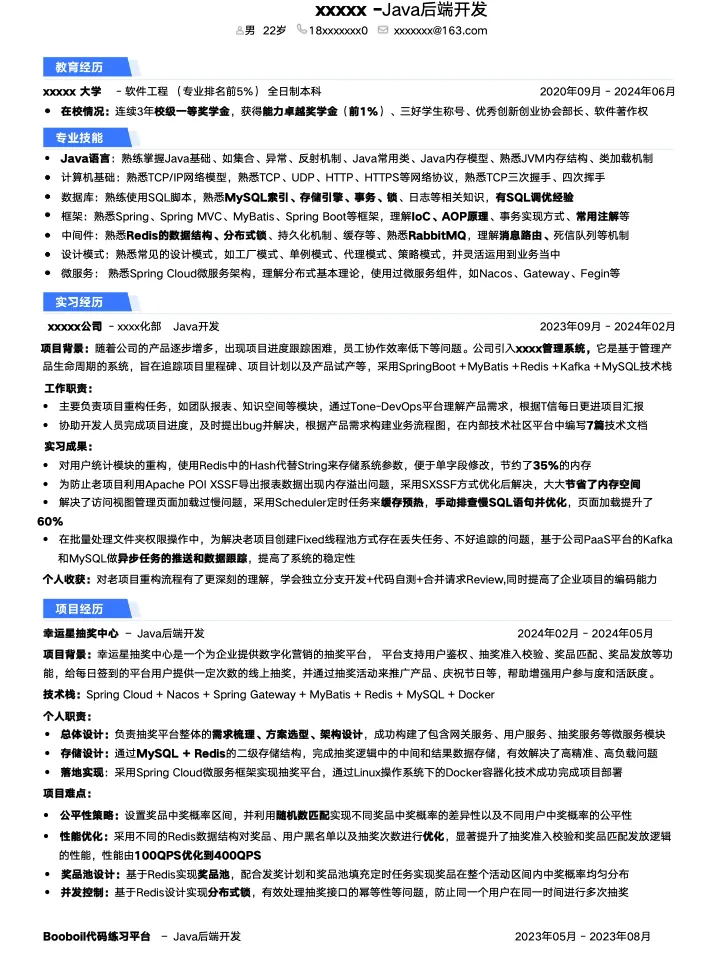
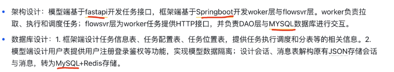
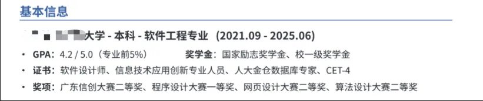
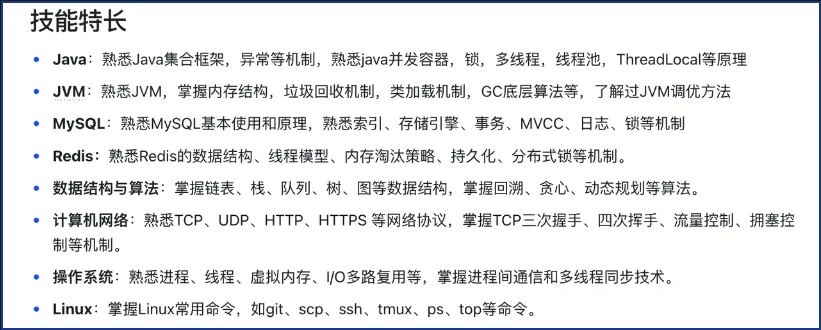
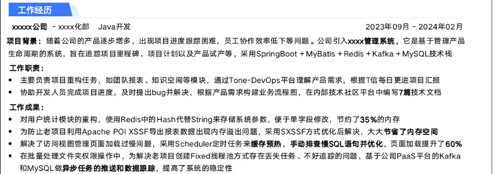
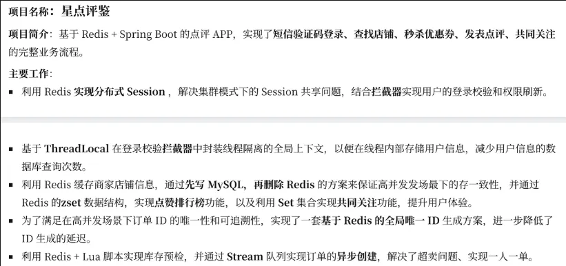
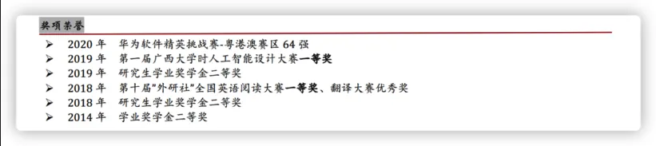

## 制作高分简历指南
### 一、 简历的重要性及筛选过程
制作一份合格的简历至关重要，特别是对于普通双非学校的学生而言，简历的重要性甚至超过想象。简历是求职者与公司的第一次接触，简历不合格将直接导致淘汰，失去尝试面试的机会。

在互联网公司中，简历通常不会第一时间被人力资源（HR）人工筛选。**第一	轮筛选要经过算法初筛系统**。系统会提取简历中的关键信息，如学校、擅长的技术栈、项目技术、英语水平、获奖证书等，并进行算法打分。只有总分数达到公司设定的及格线标准（例如 60 分）的简历才会被留下，进入后续流程。许多人投递多次却未获得面试机会，正是因为简历未能通过这一初筛关。

因此，哪怕是来自顶尖高校（如 985）的学生，如果简历内容过于空泛（太水），也会被直接刷掉。

### 二、 合格简历的基本组成和原则
#### 1. 简历应包含的模块
对于校招生而言，一份合格的简历通常应包括以下内容，并遵循大致的填写顺序：

1. **个人信息**
2. **教育背景** (时间线由近到远)
3. **专业技能**
4. **实习经历** (可选，有则写)
5. **项目经验**
6. **校园经历** (可选)
7. **奖项荣誉** (可选，如果较少或学校较弱可融入教育背景)
8. **其余模块** (如自我评价等，可选)。其余模块中可以写博客或坚持写作等积极内容。

此外，简历上也可以写一些积极向上的内容，如参加体育比赛（马拉松、自行车赛等），只要是弘扬正确价值观的都是值得褒奖的。但如果不是应聘游戏开发或游戏类产品经理，则不建议写王者或英雄联盟等游戏的高段位信息。

#### 2. 简历制作的关键原则
+ **持续迭代**：没有一份简历能一次性写好。合格的简历是根据每次面试中的反馈和不足不断修正和完善迭代的结果。
+ **不要迷信一页原则**：**最重要的是将你会的内容完整、清晰地描述清楚**。即使简历超过一页也无妨，清晰地阐述经历和经验才是最重要的。
+ **注重细节和规范**：专有名词的书写规范、大小写（如 C++ 而不是 c++，Java 而不是 java）常常被忽略。一定要做到书写规范，全局统一，因为细节决定成败。（下图为反例）

### 三、 简历各模块的撰写要点
#### 1. 个人信息模块
个人信息通常放在简历的最上方，是最先映入眼帘的部分。

+ **必须项**：姓名、性别、邮箱、联系方式、~~**应聘岗位**~~。
+ **应聘岗位**：必须将应聘岗位名称修改为与你将要投递的公司招聘的**具体岗位名称一致**。例如，如果华为招收“通用软件开发工程师”，而你写了字节跳动的“C++ 后端开发工程师”，面试官会认为你是海投选手，缺乏诚意，影响第一印象分。
+ **邮箱**：建议使用 163 等其他邮箱，避免使用 QQ 邮箱。	
+ **照片**：技术岗非必需。
+ **不建议写**：期望薪资、城市信息、民族、籍贯。

#### 2. 教育背景模块
教育背景对于校招简历而言是十分关键的一环。

+ **顺序**：必须按照	**时间由近及远（逆序）** 的顺序书写。
+ **内容**：应写清楚从高中以后的所有教育经历，不应缺失本科或大专学历。必须项包括【学校、专业、入学时间～毕业时间】。
+ **绩点/排名**：校招中成绩很重要，可以写上。如果年级排名在前 10，可以直接写排名/总人数（如 9/100）；如果排名不高，建议换成百分比描述（如 Top 20%），第一印象会更好。
+ **课程**：计算机专业的同学主修课程通常不需要写，除非某一科目成绩在 90 分以上可以标注。
+ **弱化学校**：如果学校背景一般，可以考虑不在简历中单独起一栏写教育背景，而是在个人信息部分简单提及，弱化其存在感。

#### 3. 专业技能模块
专业技能是简历中最重要的两项之一（另一个是实习/项目）。

+ **内容**：应贴合应聘岗位，后端同学至少应包括一门主攻语言、数据结构与算法、操作系统、计算机网络、数据库、其余部分。
+ **描述用词**：应使用四个等级动词：了解、熟悉、掌握、精通。**一般不建议写“精通”**，以免在面试中被问倒。
+ **策略性描述**：不要只写光秃秃的一句话（如“熟悉数据结构与算法”），应适当展开（如“熟悉常见的数据结构如链表、数组、二叉树等”）。可以战略性地“藏”起一些自己会的知识点，留到面试官提问时再展示出来，以获得加分。
+ **禁忌**：不应出现奖项证书内容，如英语四六级、计算机二级等。

#### 4. 实习经历模块
实习经历对于国内公司招聘来说非常重要，强烈建议求职者争取实习机会。

+ **结构完整**：完整的实习经历应包括：实习公司、部门、岗位、时间、**实习背景**、**主要工作**、**工作成果**。
+ **书写方式**：建议按照 **STAR 原则**来描述：【问题背景 - 解决方式 - 收益结果】。
+ **突出成果**：避免写“流水账”式的工作内容（如整天写 SQL 这种杂活）。要突出工作成果，体现解决业务难题的能力和思考能力。
+ **量化结果**：成果最好要有具体的指标说明（如“7*24 小时”、“20W”），避免使用“极大地提高了 XX 效果”等虚话。
+ **校招生角色定位**：校招生应注意项目立意和自己在项目中的角色，避免写“负责架构”、“独立完成”等表述。应写“参与设计”、“负责部分逻辑实践落地”、“在 Leader 指导下完成”。

#### 5. 项目经验模块
校招简历上至少需要 2 个项目，如果没有实习的话，最好有 3 个项目。

+ **顺序**：将你**最有把握、最想与面试官聊的项目放在项目经验列表中的第一个位置**，同时其完成时间也要是最近的，以保持逆序一致性。
+ **结构完整**：应包含项目名、起始时间、项目背景及功能、技术栈、**个人职责**、**技术难点**、收获。项目背景描述应精简（2 句话即可）。
+ **主要工作撰写（三段式）**：建议采用三段式来写主要工作，避免内容干巴巴。
    1. **第一段**：你使用了什么技术（如采用了 epoll 模式）。
    2. **第二段**：你做了什么事（如完成主节点与 N 个子节点的网络通信）。
    3. **第三段**：所完成的事对项目起到了什么作用或优化（如减少数据传输通讯时间（降低 29%）的同时保证了更好的系统兼容性）。
+ **数据量化**：最好使用数据量化成果，例如“将查询时间从 1200ms 降低到 40ms，降幅为 96.67%”，这种直观的数字对比能给面试官留下深刻印象。

#### 6. 奖项荣誉模块
+ **内容**：主要写读书阶段取得的荣誉和证书，如编程算法类比赛、奖学金等。
+ **四六级**：只要通过了四级就要写上，不写意味着未通过。如果六级分数较高（500 分以上），可以标注分数。
+ **顺序**：建议按照**时间逆序**来写。

#### 7. 校园经历模块（非必需）
校园经历对于社招不应写，否则会显得不伦不类。

+ **内容**：如果你是校招生，可以写一些与计算机或 IT 相关的经历（如开源项目、技术博客、ACM 集训队），或者体现积极向上特性的有意义的事情（如合伙创业、自媒体账号经营等）。

#### 8. 自我评价模块（非必需）
自我评价可选，但必须注意要用简洁的语言突出自己的特点和优势，且切忌太空洞和宽泛。

+ **原则**：自我评价要有**个人思考**在里面。不要千篇一律地写“爱看书、爱学习”。
+ **佐证**：每一点个人评价都需要有具体事件或事实佐证。例如，与其说热爱学习，不如写“熟读过《深入理解 Java 虚拟机》等书籍”，或“有较强的信息检索能力，曾在生产线上解决过系统 CPU 100%问题”。
+ **数量**：简历上【个人评价】写 3 点即可。

### 四、 简历模板和 LLM 知识库
> 访问 LLM 知识库需要科学上网，有些节点（例如 Hongkong）也无法访问，需要多切换节点
>

[简历模板一.docx](https://www.yuque.com/attachments/yuque/0/2025/docx/36232735/1764251953166-942816b7-eb40-47dc-a8ad-62b9c103e586.docx)

[简历模板二.docx](https://www.yuque.com/attachments/yuque/0/2025/docx/36232735/1764251953174-55e4bc79-cd9d-4cef-9f77-9448bf8b2e3c.docx)

[LLM 知识库](https://notebooklm.google.com/notebook/649c680e-9148-41c7-a42e-c8b57cc686c6)

